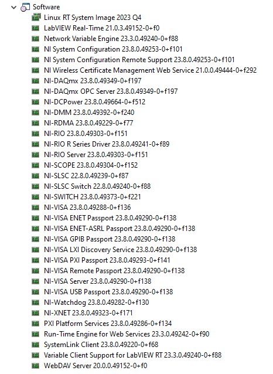
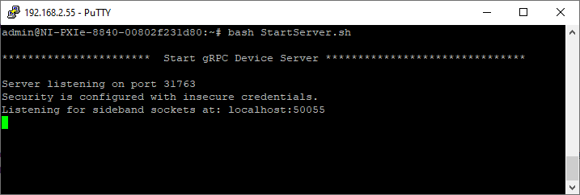
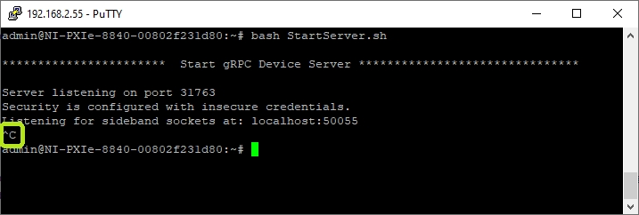
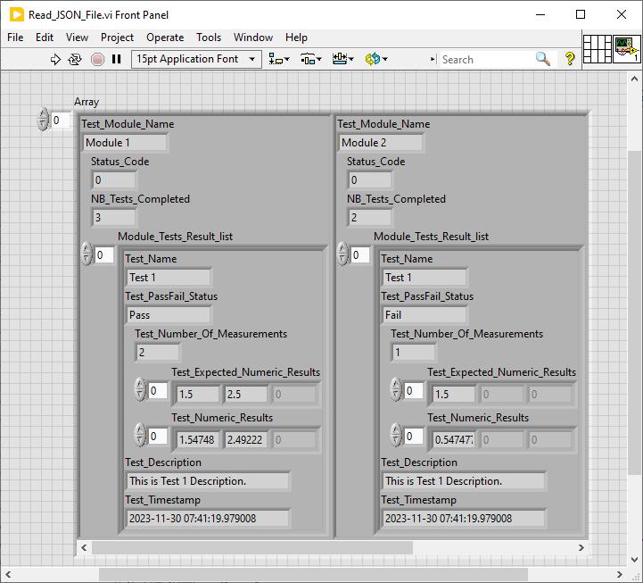
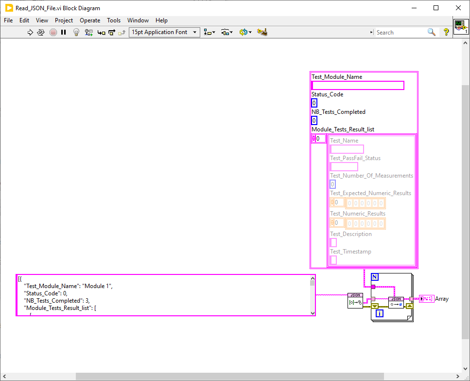

# About
Repository for HIL BMS Tester Self-Test.

The code _Self_Test.py_ expects a gRPC device server running on a machine.
The code connects to the gRPC device server, executes a series of Self-Tests and reports results on screen and in JSON file.

__The setup requires a specific external ITA for Self-Test feature__
 
# gRPC Device Server Setup
This component is expected to run on a PXI RT-Target.
## Linux-RT Image
NI-Linux RT Image used: 2023 Q4.
List of software installed on the RT-Target.




# gRPC Device ServerServer Startup
## Server Software Installation
Connect to the NI RT-Linux Target, perform following operations:
1. ```opkg update ```
3. ```opkg install git```
4. ```opkg install git-perltools```
5. ```opkg install cmake```
6. ```opkg install g++ g++-symlinks```
7. Check Python version should be 3.9 (python -V)
8. ```opkg install python3-misc```
9. ```python -m pip install mako```
## Server Software Installation
Connect to the NI RT-Linux Target, perform following operations:
1. ```git clone -b users/alhernan/fix_socket_sideband  https://github.com/vvacharya/grpc-device.git ```
2. ```cd grpc-device``` 
3. ```git submodule update --init --recursive```
4. Add following *#include <condition_variable>* to file "semaphore.h" at location:
/home/admin/grpc-device/source/server/
## Server Build
Connect to the NI RT-Linux Target, perform following operations:
1. ```ulimit -Hs unlimited ```
2. ```mkdir -p cmake/build ```
3. ```cd cmake/build ```
4. ```cmake ../..``` or to build without RDMA support you need to run ```cmake -DINCLUDE_SIDEBAND_RDMA=OFF ../.. ```
5. ```make ```
## FPGA Bitfiles
In case gRPC client needs to interact with some NI FPGA boards, these bitfiles (with .lvbitx extensions) needs to be uploaded to the gRPC server.
# gRPC Device ServerServer MANUAL Execution
This part is optional as soon as user uses the Py script ```Self_Test.py``` because that script includes the Start/Stop of the gRPC server.
## Pre-Execution Step
*Grpc-sideband.so* is added as an additional library, we haven’t added the link to cmakelists, on RT Target, but you can run this from the server folder before running the server to avoid a ‘missing grpc-sideband.so’ message:
```export LD_LIBRARY_PATH=$LD_LIBRARY_PATH:$(pwd)/grpc-sideband ```.
## Server Launch
Enter command ```./ni_grpc_device_server``` 


## Execution Script
User can use available script ```StartServer.sh```, copy it *to target*. It loads *Grpc-sideband.so* and starts server. Command to execute on target:
```console
bash StartServer.sh
```

Once started successfully, the gRPCS Device Server returns the gRPC port used. Default port is: ```31763```.
## Stop Server
User can stop gRPC Device Server on NI-PXI RT-Target using keys combination ```Ctrl+c``` in the window from which gRPC Device Server was started.




# Self-Test execution


## Self-Test dependencies
Requirements are on ```Environment/requirements.txt``` . They can be installed with ```$pip install -r requirements.txt```  on the Environment folder.


## Running Self_Test.py
The self-test code already includes some sections to start and stop the gRPC server automatically via commands sent via SSH (using [paramiko](https://pypi.org/project/paramiko/) python library). User doesn't have to follow manual steps from previous paragraph.
User just needs to start the Py script (in *Python* sub-folder):
```
Self_Test.py
```

During self-test execution, some information are displayed reflecting current operation being done. Below is an example:
```
[2023-11-27 20:02:03.163941]    DEBUG   START gRPC Server
[2023-11-27 20:02:03.165932]    DEBUG   [gRPC Server] Trying to connect to 192.168.2.55 (0/0)
[2023-11-27 20:02:03.590930]    DEBUG   [gRPC Server] >cd /home/admin/grpc-device/cmake/build;export LD_LIBRARY_PATH=$LD_LIBRARY_PATH:$(pwd)/grpc-sideband;./ni_grpc_device_server
[2023-11-27 20:02:04.665279]    DEBUG   [gRPC Server] >pidof ni_grpc_device_server
[2023-11-27 20:02:04.681271]    DEBUG   [gRPC Server] >3166
[2023-11-27 20:02:04.689271]    DEBUG   SELF-TEST START
[2023-11-27 20:02:04.804273]    DEBUG   FPGA RMIO Test Module: started.
[2023-11-27 20:02:05.250267]    DEBUG   FPGA RMIO Module: completed.
[2023-11-27 20:02:05.251267]    DEBUG   FPGA RDIO Test Module: started.
Exception, error code: -63195
[2023-11-27 20:02:05.270294]    DEBUG   FPGA RDIO Module: completed.
[2023-11-27 20:02:05.271266]    DEBUG   PXIe-6738 Test Module: started.
[2023-11-27 20:02:11.698962]    DEBUG   PXIe-6738 Test Module: completed.
[2023-11-27 20:02:11.700019]    DEBUG   PXIe-4322 Test Module: started.
[2023-11-27 20:02:13.940181]    DEBUG   PXIe-4322 Test Module: completed.
[2023-11-27 20:02:13.940181]    DEBUG   PXIe-4136_1 Test Module: started.
[2023-11-27 20:02:16.135309]    DEBUG   PXIe-4136_1 Test Module: started.
[2023-11-27 20:02:16.136314]    DEBUG   PXIe-4136_2 Test Module: started.
[2023-11-27 20:02:18.316964]    DEBUG   PXIe-4136_2 Test Module: started.
[2023-11-27 20:02:18.318999]    DEBUG   STOP gRPC Server
[2023-11-27 20:02:18.318999]    DEBUG   [gRPC Server] Trying to connect to 192.168.2.55 (0/0)       
[2023-11-27 20:02:18.411796]    DEBUG   [gRPC Server] >pidof ni_grpc_device_server
[2023-11-27 20:02:18.476796]    DEBUG   [gRPC Server] >3166
[2023-11-27 20:02:18.478796]    DEBUG   [gRPC Server] >kill 3166
[2023-11-27 20:02:18.543796]    DEBUG   SELF-TEST END
```
# Report
This section shows the console output window for a Self-Test with a single Test Module *RMIO*. By default, the report is displayed and logged to a TXT file.
```
******************************************** GLOBAL PASS/FAIL **************************************************
**********************************    GLOBAL Pass/Fail Result: FAIL    *****************************************
****************************************************************************************************************

****************************************** TESTS MODULES STATUS ************************************************
Module Name                     Module Status
RMIO                            0
RDIO                            -63195
PXIe-6738                       0
PXIe-4322                       0
PXIe-4136 Board PXI1Slot3       0
PXIe-4136 Board PXI1Slot15      0

*************************************** Tests Table (Tests Failed Only) ****************************************
Timestamp                       Test Index      Test Module                     Test Name
[2023-11-27 20:02:05.182280]    1               RMIO                            Connector 0: Digital Ports 0 and 1 Loopback
[2023-11-27 20:02:05.198268]    2               RMIO                            Connector 1: Digital Ports 0 and 1 Loopback
[2023-11-27 20:02:05.214267]    3               RMIO                            Connector 1: Digital Ports 2 and 3 Loopback
[2023-11-27 20:02:05.230290]    4               RMIO                            Connector 0: Analog Inputs/Ouputs Loopback
[2023-11-27 20:02:07.788659]    3               PXIe-6738                       PXIe-6738: check CH0
[2023-11-27 20:02:07.899988]    4               PXIe-6738                       PXIe-6738: check CH1
[2023-11-27 20:02:07.996378]    5               PXIe-6738                       PXIe-6738: check CH2
[2023-11-27 20:02:08.100658]    6               PXIe-6738                       PXIe-6738: check CH3
[2023-11-27 20:02:08.200264]    7               PXIe-6738                       PXIe-6738: check CH4
[2023-11-27 20:02:08.355366]    8               PXIe-6738                       PXIe-6738: check CH5
[2023-11-27 20:02:08.477008]    9               PXIe-6738                       PXIe-6738: check CH6
[2023-11-27 20:02:08.579388]    10              PXIe-6738                       PXIe-6738: check CH7
[2023-11-27 20:02:08.680323]    11              PXIe-6738                       PXIe-6738: check CH8
[2023-11-27 20:02:08.779461]    12              PXIe-6738                       PXIe-6738: check CH9
[2023-11-27 20:02:08.879597]    13              PXIe-6738                       PXIe-6738: check CH10
[2023-11-27 20:02:08.979535]    14              PXIe-6738                       PXIe-6738: check CH11
[2023-11-27 20:02:09.087926]    15              PXIe-6738                       PXIe-6738: check CH12
[2023-11-27 20:02:09.191330]    16              PXIe-6738                       PXIe-6738: check CH13
[2023-11-27 20:02:09.289643]    17              PXIe-6738                       PXIe-6738: check CH14
[2023-11-27 20:02:09.456217]    18              PXIe-6738                       PXIe-6738: check CH15
[2023-11-27 20:02:09.559418]    19              PXIe-6738                       PXIe-6738: check CH16
[2023-11-27 20:02:09.659584]    20              PXIe-6738                       PXIe-6738: check CH17
[2023-11-27 20:02:09.759717]    21              PXIe-6738                       PXIe-6738: check CH18
[2023-11-27 20:02:09.860645]    22              PXIe-6738                       PXIe-6738: check CH19
[2023-11-27 20:02:09.959173]    23              PXIe-6738                       PXIe-6738: check CH20
[2023-11-27 20:02:10.060899]    24              PXIe-6738                       PXIe-6738: check CH21
[2023-11-27 20:02:10.158809]    25              PXIe-6738                       PXIe-6738: check CH22
[2023-11-27 20:02:10.259237]    26              PXIe-6738                       PXIe-6738: check CH23
[2023-11-27 20:02:10.361623]    27              PXIe-6738                       PXIe-6738: check CH24
[2023-11-27 20:02:10.558416]    28              PXIe-6738                       PXIe-6738: check CH25
[2023-11-27 20:02:10.659130]    29              PXIe-6738                       PXIe-6738: check CH26
[2023-11-27 20:02:10.759159]    30              PXIe-6738                       PXIe-6738: check CH27
[2023-11-27 20:02:10.860212]    31              PXIe-6738                       PXIe-6738: check CH28
[2023-11-27 20:02:10.959667]    32              PXIe-6738                       PXIe-6738: check CH29
[2023-11-27 20:02:11.059973]    33              PXIe-6738                       PXIe-6738: check CH30
[2023-11-27 20:02:11.160119]    34              PXIe-6738                       PXIe-6738: check CH31
[2023-11-27 20:02:12.753089]    3               PXIe-4322                       PXIe-4322: check CH0
[2023-11-27 20:02:12.859907]    4               PXIe-4322                       PXIe-4322: check CH1
[2023-11-27 20:02:12.959675]    5               PXIe-4322                       PXIe-4322: check CH2
[2023-11-27 20:02:13.059299]    6               PXIe-4322                       PXIe-4322: check CH3
[2023-11-27 20:02:13.159949]    7               PXIe-4322                       PXIe-4322: check CH4
[2023-11-27 20:02:13.259755]    8               PXIe-4322                       PXIe-4322: check CH5
[2023-11-27 20:02:13.359064]    9               PXIe-4322                       PXIe-4322: check CH6
[2023-11-27 20:02:13.460171]    10              PXIe-4322                       PXIe-4322: check CH7
[2023-11-27 20:02:15.380566]    4               PXIe-4136 Board PXI1Slot3       PXI-4080: acquisiton
[2023-11-27 20:02:17.585883]    4               PXIe-4136 Board PXI1Slot15      PXI-4080: acquisiton

*************************************** Tests Table (Tests Passed Only) ****************************************
Timestamp                       Test Index      Test Module                     Test Name
[2023-11-27 20:02:05.295271]    1               PXIe-6738                       PXI-2584: connect ch0 -> com0
[2023-11-27 20:02:07.036422]    2               PXIe-6738                       PXI-4080: Configure DMM for Voltage Measurement
[2023-11-27 20:02:11.367427]    35              PXIe-6738                       PXI-2584: Disconnect All
[2023-11-27 20:02:11.714968]    1               PXIe-4322                       PXI-2584: connect ch1 -> com0
[2023-11-27 20:02:11.891200]    2               PXIe-4322                       PXI-4080: Configure DMM for Voltage Measurement
[2023-11-27 20:02:13.698419]    11              PXIe-4322                       PXI-2584: Disconnect All
[2023-11-27 20:02:13.971174]    1               PXIe-4136 Board PXI1Slot3       PXI-2584: connect ch2 -> com0
[2023-11-27 20:02:14.174058]    2               PXIe-4136 Board PXI1Slot3       PXI-4080: Configure DMM for Voltage Measurement
[2023-11-27 20:02:14.965319]    3               PXIe-4136 Board PXI1Slot3       PXIe-4136: CH0
[2023-11-27 20:02:15.767971]    5               PXIe-4136 Board PXI1Slot3       PXI-2584: Disconnect All
[2023-11-27 20:02:16.137313]    1               PXIe-4136 Board PXI1Slot15      PXI-2584: connect ch3 -> com0
[2023-11-27 20:02:16.351700]    2               PXIe-4136 Board PXI1Slot15      PXI-4080: Configure DMM for Voltage Measurement
[2023-11-27 20:02:17.166865]    3               PXIe-4136 Board PXI1Slot15      PXIe-4136: CH0
[2023-11-27 20:02:17.920723]    5               PXIe-4136 Board PXI1Slot15      PXI-2584: Disconnect All

******************************************* REPORT completed ***************************************************

********************************************** DATA LOGGING ****************************************************
NB Modules logged to file:              6
******************************************** DATA RETRIEVING ***************************************************
NB Modules read back from file:         6
************************************************* END **********************************************************
```
## Reports sections breakdown
Once the Self-Test tests are completed, following message is displayed:
```
----------------------------------------  Tests Execution Completed  -------------------------------------------
```
Then, actual results report starts. At high-level, there is a global (global to all Tests from all Modules) Pass/Fail Result computed. This is just a AND between all individual Tests results. If the AND logical operation result is TRUE, then the GLOBAL Pass/Fail Result is **PASS**, otherwise, it's **FAIL**.
```
******************************************** GLOBAL PASS/FAIL **************************************************
**********************************    GLOBAL Pass/Fail Result: FAIL    *****************************************
****************************************************************************************************************
```
Next section gives information about each Test Module (one line per Test Module). We consider that a Test Module Execution went fine if its execution happened without any error. In that case, reported status code should be 0. In case of error, the reported value is the error code. As soon as at least one Test Module execution reports an error, then reported GLOBAL Pass/Fail Result will be 'FAIL'. When a Test Module Execution failed, the Tests from that specific Test Module are not executed. So, those Tests are not listed as Failed (absent from Failed Tests Table).
```

****************************************** TESTS MODULES STATUS ************************************************
Module Name                     Module Status
RMIO                            0
RDIO                            -63195
PXIe-6738                       0
PXIe-4322                       0
PXIe-4136 Board PXI1Slot3       0
PXIe-4136 Board PXI1Slot15      0
```
Last section of the report is a table of all the individual Tests for different Test Modules which were executed. It's important to note that test *Test Index* column is a sequential index in the table, it doesn't refer to anything by itself. Tests results are organized by Test Status: Pass or Fail.
```
*************************************** Tests Table (Tests Failed Only) ****************************************
Timestamp                       Test Index      Test Module                     Test Name
[2023-11-27 20:02:05.182280]    1               RMIO                            Connector 0: Digital Ports 0 and 1 Loopback
[2023-11-27 20:02:05.198268]    2               RMIO                            Connector 1: Digital Ports 0 and 1 Loopback
[2023-11-27 20:02:05.214267]    3               RMIO                            Connector 1: Digital Ports 2 and 3 Loopback
[2023-11-27 20:02:05.230290]    4               RMIO                            Connector 0: Analog Inputs/Ouputs Loopback
[2023-11-27 20:02:07.788659]    3               PXIe-6738                       PXIe-6738: check CH0
[2023-11-27 20:02:07.899988]    4               PXIe-6738                       PXIe-6738: check CH1
[2023-11-27 20:02:07.996378]    5               PXIe-6738                       PXIe-6738: check CH2
[2023-11-27 20:02:08.100658]    6               PXIe-6738                       PXIe-6738: check CH3
[2023-11-27 20:02:08.200264]    7               PXIe-6738                       PXIe-6738: check CH4
[2023-11-27 20:02:08.355366]    8               PXIe-6738                       PXIe-6738: check CH5
[2023-11-27 20:02:08.477008]    9               PXIe-6738                       PXIe-6738: check CH6
[2023-11-27 20:02:08.579388]    10              PXIe-6738                       PXIe-6738: check CH7
[2023-11-27 20:02:08.680323]    11              PXIe-6738                       PXIe-6738: check CH8
[2023-11-27 20:02:08.779461]    12              PXIe-6738                       PXIe-6738: check CH9
[2023-11-27 20:02:08.879597]    13              PXIe-6738                       PXIe-6738: check CH10
[2023-11-27 20:02:08.979535]    14              PXIe-6738                       PXIe-6738: check CH11
[2023-11-27 20:02:09.087926]    15              PXIe-6738                       PXIe-6738: check CH12
[2023-11-27 20:02:09.191330]    16              PXIe-6738                       PXIe-6738: check CH13
[2023-11-27 20:02:09.289643]    17              PXIe-6738                       PXIe-6738: check CH14
[2023-11-27 20:02:09.456217]    18              PXIe-6738                       PXIe-6738: check CH15
[2023-11-27 20:02:09.559418]    19              PXIe-6738                       PXIe-6738: check CH16
[2023-11-27 20:02:09.659584]    20              PXIe-6738                       PXIe-6738: check CH17
[2023-11-27 20:02:09.759717]    21              PXIe-6738                       PXIe-6738: check CH18
[2023-11-27 20:02:09.860645]    22              PXIe-6738                       PXIe-6738: check CH19
[2023-11-27 20:02:09.959173]    23              PXIe-6738                       PXIe-6738: check CH20
[2023-11-27 20:02:10.060899]    24              PXIe-6738                       PXIe-6738: check CH21
[2023-11-27 20:02:10.158809]    25              PXIe-6738                       PXIe-6738: check CH22
[2023-11-27 20:02:10.259237]    26              PXIe-6738                       PXIe-6738: check CH23
[2023-11-27 20:02:10.361623]    27              PXIe-6738                       PXIe-6738: check CH24
[2023-11-27 20:02:10.558416]    28              PXIe-6738                       PXIe-6738: check CH25
[2023-11-27 20:02:10.659130]    29              PXIe-6738                       PXIe-6738: check CH26
[2023-11-27 20:02:10.759159]    30              PXIe-6738                       PXIe-6738: check CH27
[2023-11-27 20:02:10.860212]    31              PXIe-6738                       PXIe-6738: check CH28
[2023-11-27 20:02:10.959667]    32              PXIe-6738                       PXIe-6738: check CH29
[2023-11-27 20:02:11.059973]    33              PXIe-6738                       PXIe-6738: check CH30
[2023-11-27 20:02:11.160119]    34              PXIe-6738                       PXIe-6738: check CH31
[2023-11-27 20:02:12.753089]    3               PXIe-4322                       PXIe-4322: check CH0
[2023-11-27 20:02:12.859907]    4               PXIe-4322                       PXIe-4322: check CH1
[2023-11-27 20:02:12.959675]    5               PXIe-4322                       PXIe-4322: check CH2
[2023-11-27 20:02:13.059299]    6               PXIe-4322                       PXIe-4322: check CH3
[2023-11-27 20:02:13.159949]    7               PXIe-4322                       PXIe-4322: check CH4
[2023-11-27 20:02:13.259755]    8               PXIe-4322                       PXIe-4322: check CH5
[2023-11-27 20:02:13.359064]    9               PXIe-4322                       PXIe-4322: check CH6
[2023-11-27 20:02:13.460171]    10              PXIe-4322                       PXIe-4322: check CH7
[2023-11-27 20:02:15.380566]    4               PXIe-4136 Board PXI1Slot3       PXI-4080: acquisiton
[2023-11-27 20:02:17.585883]    4               PXIe-4136 Board PXI1Slot15      PXI-4080: acquisiton

*************************************** Tests Table (Tests Passed Only) ****************************************
Timestamp                       Test Index      Test Module                     Test Name
[2023-11-27 20:02:05.295271]    1               PXIe-6738                       PXI-2584: connect ch0 -> com0
[2023-11-27 20:02:07.036422]    2               PXIe-6738                       PXI-4080: Configure DMM for Voltage Measurement
[2023-11-27 20:02:11.367427]    35              PXIe-6738                       PXI-2584: Disconnect All
[2023-11-27 20:02:11.714968]    1               PXIe-4322                       PXI-2584: connect ch1 -> com0
[2023-11-27 20:02:11.891200]    2               PXIe-4322                       PXI-4080: Configure DMM for Voltage Measurement
[2023-11-27 20:02:13.698419]    11              PXIe-4322                       PXI-2584: Disconnect All
[2023-11-27 20:02:13.971174]    1               PXIe-4136 Board PXI1Slot3       PXI-2584: connect ch2 -> com0
[2023-11-27 20:02:14.174058]    2               PXIe-4136 Board PXI1Slot3       PXI-4080: Configure DMM for Voltage Measurement
[2023-11-27 20:02:14.965319]    3               PXIe-4136 Board PXI1Slot3       PXIe-4136: CH0
[2023-11-27 20:02:15.767971]    5               PXIe-4136 Board PXI1Slot3       PXI-2584: Disconnect All
[2023-11-27 20:02:16.137313]    1               PXIe-4136 Board PXI1Slot15      PXI-2584: connect ch3 -> com0
[2023-11-27 20:02:16.351700]    2               PXIe-4136 Board PXI1Slot15      PXI-4080: Configure DMM for Voltage Measurement
[2023-11-27 20:02:17.166865]    3               PXIe-4136 Board PXI1Slot15      PXIe-4136: CH0
[2023-11-27 20:02:17.920723]    5               PXIe-4136 Board PXI1Slot15      PXI-2584: Disconnect All

******************************************* REPORT completed ***************************************************
```

# JSON Results Reports Files Examples
At the end of the Self-Test execution, results are formatted into JSON format and logged to a file. There are 2 approaches to log Measurements Data, both are based on JSON.
## JSON report file using Jsonpickle Python library
[Jsonpickle](https://jsonpickle.github.io/) Python library is used to serialize results to JSON.
This section shows the JSON file created for a Self-Test with a single Test Module *RMIO* and JsonPicke approach.

```[{"py/object": "SelfTest_CF.Module_Result", "Test_Module_Name": "RMIO", "Status_Code": 0, "NB_Tests_Completed": 4, "Module_Tests_Result_list": [{"py/object": "SelfTest_CF.Test_Result", "Test_Name": "Connector 0: Digital Ports 0 and 1 Loopback", "Test_PassFail_Status": "Fail", "Test_Number_Of_Measurements": 2, "Test_Numeric_Result": [21, 10], "Test_Numeric_Expected_Result": [85, 170], "Test_Description": "This test checks digital IOs from Port 0 and Port 1 of Connector 0. This test requires an external loopback between the 2 ports. 2 values (0x55(85d) and 0xAA(170d)) are sequentially written on Port 0 with a read on Port 1.", "Test_Timestamp": {"py/object": "datetime.datetime", "__reduce__": [{"py/type": "datetime.datetime"}, ["B+cLGxQCBQLICA=="]]}}, {"py/object": "SelfTest_CF.Test_Result", "Test_Name": "Connector 1: Digital Ports 0 and 1 Loopback", "Test_PassFail_Status": "Fail", "Test_Number_Of_Measurements": 2, "Test_Numeric_Result": [0, 0], "Test_Numeric_Expected_Result": [85, 170], "Test_Description": "This test checks digital IOs from Port 0 and Port 1 of Connector 1. This test requires an external loopback between the 2 ports. 2 values (0x55(85d) and 0xAA(170d)) are sequentially written on Port 0 with a read on Port 1.", "Test_Timestamp": {"py/object": "datetime.datetime", "__reduce__": [{"py/type": "datetime.datetime"}, ["B+cLGxQCBQMGfA=="]]}}, {"py/object": "SelfTest_CF.Test_Result", "Test_Name": "Connector 1: Digital Ports 2 and 3 Loopback", "Test_PassFail_Status": "Fail", "Test_Number_Of_Measurements": 2, "Test_Numeric_Result": [0, 0], "Test_Numeric_Expected_Result": [85, 170], "Test_Description": "This test checks digital IOs from Port 2 and Port 3 of Connector 1. This test requires an external loopback between the 2 ports. 2 values (0x55(85d) and 0xAA(170d)) are sequentially written on Port 2 with a read on Port 3.", "Test_Timestamp": {"py/object": "datetime.datetime", "__reduce__": [{"py/type": "datetime.datetime"}, ["B+cLGxQCBQNE+w=="]]}}, {"py/object": "SelfTest_CF.Test_Result", "Test_Name": "Connector 0: Analog Inputs/Ouputs Loopback", "Test_PassFail_Status": "Fail", "Test_Number_Of_Measurements": 8, "Test_Numeric_Result": [0.9996019313465245, 1.9981395620597167, 2.998835357946055, -10.377691015071035, -10.50005650083498, -7.534452404285684, -10.49812554858826, -0.5364163406877457], "Test_Numeric_Expected_Result": [1.0, 2.0, 3.0, 4.0, 5.0, 6.0, 7.0, 8.0], "Test_Description": "This test checks analog inputs/outputs. This test requires an external loopback between the AIx and AOx. 8 values (1.0,2.0,3.0,4.0,5.0,6.0,7.0,8.0) are written on AOx.", "Test_Timestamp": {"py/object": "datetime.datetime", "__reduce__": [{"py/type": "datetime.datetime"}, ["B+cLGxQCBQODkg=="]]}}]}, {"py/object": "SelfTest_CF.Module_Result", "Test_Module_Name": "RDIO", "Status_Code": -63195, "NB_Tests_Completed": 0, "Module_Tests_Result_list": []}, {"py/object": "SelfTest_CF.Module_Result", "Test_Module_Name": "PXIe-6738", "Status_Code": 0, "NB_Tests_Completed": 35, "Module_Tests_Result_list": [{"py/object": "SelfTest_CF.Test_Result", "Test_Name": "PXI-2584: connect ch0 -> com0", "Test_PassFail_Status": "Pass", "Test_Number_Of_Measurements": 1, "Test_Numeric_Result": [0], "Test_Numeric_Expected_Result": [0], "Test_Description": "This test configures the PXI-2584 in 2 Wires (6x1) topology then it routes CH0 to com0.", "Test_Timestamp": {"py/object": "datetime.datetime", "__reduce__": [{"py/type": "datetime.datetime"}, ["B+cLGxQCBQSBZw=="]]}}, {"py/object": "SelfTest_CF.Test_Result", "Test_Name": "PXI-4080: Configure DMM for Voltage Measurement", "Test_PassFail_Status": "Pass", "Test_Number_Of_Measurements": 1, "Test_Numeric_Result": [0], "Test_Numeric_Expected_Result": [0], "Test_Description": "This test configures the PXI-4080 DMM for Voltage measurement.", "Test_Timestamp": {"py/object": "datetime.datetime", "__reduce__": [{"py/type": "datetime.datetime"}, ["B+cLGxQCBwCORg=="]]}}, {"py/object": "SelfTest_CF.Test_Result", "Test_Name": "PXIe-6738: check CH0", "Test_PassFail_Status": "Fail", "Test_Number_Of_Measurements": 1, "Test_Numeric_Result": [{"py/reduce": [{"py/function": "numpy.core.multiarray.scalar"}, {"py/tuple": [{"py/reduce": [{"py/type": "numpy.dtype"}, {"py/tuple": ["f8", false, true]}, {"py/tuple": [3, "<", null, null, null, -1, -1, 0]}]}, {"py/b64": "JLqKeSQAFEA="}]}]}], "Test_Numeric_Expected_Result": [-4.0], "Test_Description": "This test outputs V on channel ch0 and measures actual value using DMM.", "Test_Timestamp": {"py/object": "datetime.datetime", "__reduce__": [{"py/type": "datetime.datetime"}, ["B+cLGxQCBwwIsw=="]]}}, {"py/object": "SelfTest_CF.Test_Result", "Test_Name": "PXIe-6738: check CH1", "Test_PassFail_Status": "Fail", "Test_Number_Of_Measurements": 1, "Test_Numeric_Result": [{"py/reduce": [{"py/function": "numpy.core.multiarray.scalar"}, {"py/tuple": [{"py/id": 34}, {"py/b64": "JLqKeSQAFEA="}]}]}], "Test_Numeric_Expected_Result": [-3.75], "Test_Description": "This test outputs V on channel ch1 and measures actual value using DMM.", "Test_Timestamp": {"py/object": "datetime.datetime", "__reduce__": [{"py/type": "datetime.datetime"}, ["B+cLGxQCBw27lA=="]]}}, {"py/object": "SelfTest_CF.Test_Result", "Test_Name": "PXIe-6738: check CH2", "Test_PassFail_Status": "Fail", "Test_Number_Of_Measurements": 1, "Test_Numeric_Result": [{"py/reduce": [{"py/function": "numpy.core.multiarray.scalar"}, {"py/tuple": [{"py/id": 34}, {"py/b64": "JLqKeSQAFEA="}]}]}], "Test_Numeric_Expected_Result": [-3.5], "Test_Description": "This test outputs V on channel ch2 and measures actual value using DMM.", "Test_Timestamp": {"py/object": "datetime.datetime", "__reduce__": [{"py/type": "datetime.datetime"}, ["B+cLGxQCBw80Gg=="]]}}, {"py/object": "SelfTest_CF.Test_Result", "Test_Name": "PXIe-6738: check CH3", "Test_PassFail_Status": "Fail", "Test_Number_Of_Measurements": 1, "Test_Numeric_Result": [{"py/reduce": [{"py/function": "numpy.core.multiarray.scalar"}, {"py/tuple": [{"py/id": 34}, {"py/b64": "JLqKeSQAFEA="}]}]}], "Test_Numeric_Expected_Result": [-3.25], "Test_Description": "This test outputs V on channel ch3 and measures actual value using DMM.", "Test_Timestamp": {"py/object": "datetime.datetime", "__reduce__": [{"py/type": "datetime.datetime"}, ["B+cLGxQCCAGJMg=="]]}}, {"py/object": "SelfTest_CF.Test_Result", "Test_Name": "PXIe-6738: check CH4", "Test_PassFail_Status": "Fail", "Test_Number_Of_Measurements": 1, "Test_Numeric_Result": [{"py/reduce": [{"py/function": "numpy.core.multiarray.scalar"}, {"py/tuple": [{"py/id": 34}, {"py/b64": "JLqKeSQAFEA="}]}]}], "Test_Numeric_Expected_Result": [-3.0], "Test_Description": "This test outputs V on channel ch4 and measures actual value using DMM.", "Test_Timestamp": {"py/object": "datetime.datetime", "__reduce__": [{"py/type": "datetime.datetime"}, ["B+cLGxQCCAMOSA=="]]}}, {"py/object": "SelfTest_CF.Test_Result", "Test_Name": "PXIe-6738: check CH5", "Test_PassFail_Status": "Fail", "Test_Number_Of_Measurements": 1, "Test_Numeric_Result": [{"py/reduce": [{"py/function": "numpy.core.multiarray.scalar"}, {"py/tuple": [{"py/id": 34}, {"py/b64": "JLqKeSQAFEA="}]}]}], "Test_Numeric_Expected_Result": [-2.75], "Test_Description": "This test outputs V on channel ch5 and measures actual value using DMM.", "Test_Timestamp": {"py/object": "datetime.datetime", "__reduce__": [{"py/type": "datetime.datetime"}, ["B+cLGxQCCAVsJg=="]]}}, {"py/object": "SelfTest_CF.Test_Result", "Test_Name": "PXIe-6738: check CH6", "Test_PassFail_Status": "Fail", "Test_Number_Of_Measurements": 1, "Test_Numeric_Result": [{"py/reduce": [{"py/function": "numpy.core.multiarray.scalar"}, {"py/tuple": [{"py/id": 34}, {"py/b64": "LXf95CMAFEA="}]}]}], "Test_Numeric_Expected_Result": [-2.5], "Test_Description": "This test outputs V on channel ch6 and measures actual value using DMM.", "Test_Timestamp": {"py/object": "datetime.datetime", "__reduce__": [{"py/type": "datetime.datetime"}, ["B+cLGxQCCAdHUA=="]]}}, {"py/object": "SelfTest_CF.Test_Result", "Test_Name": "PXIe-6738: check CH7", "Test_PassFail_Status": "Fail", "Test_Number_Of_Measurements": 1, "Test_Numeric_Result": [{"py/reduce": [{"py/function": "numpy.core.multiarray.scalar"}, {"py/tuple": [{"py/id": 34}, {"py/b64": "LXf95CMAFEA="}]}]}], "Test_Numeric_Expected_Result": [-2.25], "Test_Description": "This test outputs V on channel ch7 and measures actual value using DMM.", "Test_Timestamp": {"py/object": "datetime.datetime", "__reduce__": [{"py/type": "datetime.datetime"}, ["B+cLGxQCCAjXPA=="]]}}, {"py/object": "SelfTest_CF.Test_Result", "Test_Name": "PXIe-6738: check CH8", "Test_PassFail_Status": "Fail", "Test_Number_Of_Measurements": 1, "Test_Numeric_Result": [{"py/reduce": [{"py/function": "numpy.core.multiarray.scalar"}, {"py/tuple": [{"py/id": 34}, {"py/b64": "LXf95CMAFEA="}]}]}], "Test_Numeric_Expected_Result": [-2.0], "Test_Description": "This test outputs V on channel ch8 and measures actual value using DMM.", "Test_Timestamp": {"py/object": "datetime.datetime", "__reduce__": [{"py/type": "datetime.datetime"}, ["B+cLGxQCCAphgw=="]]}}, {"py/object": "SelfTest_CF.Test_Result", "Test_Name": "PXIe-6738: check CH9", "Test_PassFail_Status": "Fail", "Test_Number_Of_Measurements": 1, "Test_Numeric_Result": [{"py/reduce": [{"py/function": "numpy.core.multiarray.scalar"}, {"py/tuple": [{"py/id": 34}, {"py/b64": "LXf95CMAFEA="}]}]}], "Test_Numeric_Expected_Result": [-1.75], "Test_Description": "This test outputs V on channel ch9 and measures actual value using DMM.", "Test_Timestamp": {"py/object": "datetime.datetime", "__reduce__": [{"py/type": "datetime.datetime"}, ["B+cLGxQCCAvkxQ=="]]}}, {"py/object": "SelfTest_CF.Test_Result", "Test_Name": "PXIe-6738: check CH10", "Test_PassFail_Status": "Fail", "Test_Number_Of_Measurements": 1, "Test_Numeric_Result": [{"py/reduce": [{"py/function": "numpy.core.multiarray.scalar"}, {"py/tuple": [{"py/id": 34}, {"py/b64": "LXf95CMAFEA="}]}]}], "Test_Numeric_Expected_Result": [-1.5], "Test_Description": "This test outputs V on channel ch10 and measures actual value using DMM.", "Test_Timestamp": {"py/object": "datetime.datetime", "__reduce__": [{"py/type": "datetime.datetime"}, ["B+cLGxQCCA1r7Q=="]]}}, {"py/object": "SelfTest_CF.Test_Result", "Test_Name": "PXIe-6738: check CH11", "Test_PassFail_Status": "Fail", "Test_Number_Of_Measurements": 1, "Test_Numeric_Result": [{"py/reduce": [{"py/function": "numpy.core.multiarray.scalar"}, {"py/tuple": [{"py/id": 34}, {"py/b64": "LXf95CMAFEA="}]}]}], "Test_Numeric_Expected_Result": [-1.25], "Test_Description": "This test outputs V on channel ch11 and measures actual value using DMM.", "Test_Timestamp": {"py/object": "datetime.datetime", "__reduce__": [{"py/type": "datetime.datetime"}, ["B+cLGxQCCA7yTw=="]]}}, {"py/object": "SelfTest_CF.Test_Result", "Test_Name": "PXIe-6738: check CH12", "Test_PassFail_Status": "Fail", "Test_Number_Of_Measurements": 1, "Test_Numeric_Result": [{"py/reduce": [{"py/function": "numpy.core.multiarray.scalar"}, {"py/tuple": [{"py/id": 34}, {"py/b64": "LXf95CMAFEA="}]}]}], "Test_Numeric_Expected_Result": [-1.0], "Test_Description": "This test outputs V on channel ch12 and measures actual value using DMM.", "Test_Timestamp": {"py/object": "datetime.datetime", "__reduce__": [{"py/type": "datetime.datetime"}, ["B+cLGxQCCQFXdg=="]]}}, {"py/object": "SelfTest_CF.Test_Result", "Test_Name": "PXIe-6738: check CH13", "Test_PassFail_Status": "Fail", "Test_Number_Of_Measurements": 1, "Test_Numeric_Result": [{"py/reduce": [{"py/function": "numpy.core.multiarray.scalar"}, {"py/tuple": [{"py/id": 34}, {"py/b64": "LXf95CMAFEA="}]}]}], "Test_Numeric_Expected_Result": [-0.75], "Test_Description": "This test outputs V on channel ch13 and measures actual value using DMM.", "Test_Timestamp": {"py/object": "datetime.datetime", "__reduce__": [{"py/type": "datetime.datetime"}, ["B+cLGxQCCQLrYg=="]]}}, {"py/object": "SelfTest_CF.Test_Result", "Test_Name": "PXIe-6738: check CH14", "Test_PassFail_Status": "Fail", "Test_Number_Of_Measurements": 1, "Test_Numeric_Result": [{"py/reduce": [{"py/function": "numpy.core.multiarray.scalar"}, {"py/tuple": [{"py/id": 34}, {"py/b64": "LXf95CMAFEA="}]}]}], "Test_Numeric_Expected_Result": [-0.5], "Test_Description": "This test outputs V on channel ch14 and measures actual value using DMM.", "Test_Timestamp": {"py/object": "datetime.datetime", "__reduce__": [{"py/type": "datetime.datetime"}, ["B+cLGxQCCQRraw=="]]}}, {"py/object": "SelfTest_CF.Test_Result", "Test_Name": "PXIe-6738: check CH15", "Test_PassFail_Status": "Fail", "Test_Number_Of_Measurements": 1, "Test_Numeric_Result": [{"py/reduce": [{"py/function": "numpy.core.multiarray.scalar"}, {"py/tuple": [{"py/id": 34}, {"py/b64": "/FCD8ygAFEA="}]}]}], "Test_Numeric_Expected_Result": [-0.25], "Test_Description": "This test outputs V on channel ch15 and measures actual value using DMM.", "Test_Timestamp": {"py/object": "datetime.datetime", "__reduce__": [{"py/type": "datetime.datetime"}, ["B+cLGxQCCQb2GQ=="]]}}, {"py/object": "SelfTest_CF.Test_Result", "Test_Name": "PXIe-6738: check CH16", "Test_PassFail_Status": "Fail", "Test_Number_Of_Measurements": 1, "Test_Numeric_Result": [{"py/reduce": [{"py/function": "numpy.core.multiarray.scalar"}, {"py/tuple": [{"py/id": 34}, {"py/b64": "/FCD8ygAFEA="}]}]}], "Test_Numeric_Expected_Result": [0.0], "Test_Description": "This test outputs V on channel ch16 and measures actual value using DMM.", "Test_Timestamp": {"py/object": "datetime.datetime", "__reduce__": [{"py/type": "datetime.datetime"}, ["B+cLGxQCCQiJOg=="]]}}, {"py/object": "SelfTest_CF.Test_Result", "Test_Name": "PXIe-6738: check CH17", "Test_PassFail_Status": "Fail", "Test_Number_Of_Measurements": 1, "Test_Numeric_Result": [{"py/reduce": [{"py/function": "numpy.core.multiarray.scalar"}, {"py/tuple": [{"py/id": 34}, {"py/b64": "/FCD8ygAFEA="}]}]}], "Test_Numeric_Expected_Result": [0.25], "Test_Description": "This test outputs V on channel ch17 and measures actual value using DMM.", "Test_Timestamp": {"py/object": "datetime.datetime", "__reduce__": [{"py/type": "datetime.datetime"}, ["B+cLGxQCCQoQgA=="]]}}, {"py/object": "SelfTest_CF.Test_Result", "Test_Name": "PXIe-6738: check CH18", "Test_PassFail_Status": "Fail", "Test_Number_Of_Measurements": 1, "Test_Numeric_Result": [{"py/reduce": [{"py/function": "numpy.core.multiarray.scalar"}, {"py/tuple": [{"py/id": 34}, {"py/b64": "/FCD8ygAFEA="}]}]}], "Test_Numeric_Expected_Result": [0.5], "Test_Description": "This test outputs V on channel ch18 and measures actual value using DMM.", "Test_Timestamp": {"py/object": "datetime.datetime", "__reduce__": [{"py/type": "datetime.datetime"}, ["B+cLGxQCCQuXpQ=="]]}}, {"py/object": "SelfTest_CF.Test_Result", "Test_Name": "PXIe-6738: check CH19", "Test_PassFail_Status": "Fail", "Test_Number_Of_Measurements": 1, "Test_Numeric_Result": [{"py/reduce": [{"py/function": "numpy.core.multiarray.scalar"}, {"py/tuple": [{"py/id": 34}, {"py/b64": "/FCD8ygAFEA="}]}]}], "Test_Numeric_Expected_Result": [0.75], "Test_Description": "This test outputs V on channel ch19 and measures actual value using DMM.", "Test_Timestamp": {"py/object": "datetime.datetime", "__reduce__": [{"py/type": "datetime.datetime"}, ["B+cLGxQCCQ0h5Q=="]]}}, {"py/object": "SelfTest_CF.Test_Result", "Test_Name": "PXIe-6738: check CH20", "Test_PassFail_Status": "Fail", "Test_Number_Of_Measurements": 1, "Test_Numeric_Result": [{"py/reduce": [{"py/function": "numpy.core.multiarray.scalar"}, {"py/tuple": [{"py/id": 34}, {"py/b64": "/FCD8ygAFEA="}]}]}], "Test_Numeric_Expected_Result": [1.0], "Test_Description": "This test outputs V on channel ch20 and measures actual value using DMM.", "Test_Timestamp": {"py/object": "datetime.datetime", "__reduce__": [{"py/type": "datetime.datetime"}, ["B+cLGxQCCQ6ixQ=="]]}}, {"py/object": "SelfTest_CF.Test_Result", "Test_Name": "PXIe-6738: check CH21", "Test_PassFail_Status": "Fail", "Test_Number_Of_Measurements": 1, "Test_Numeric_Result": [{"py/reduce": [{"py/function": "numpy.core.multiarray.scalar"}, {"py/tuple": [{"py/id": 34}, {"py/b64": "/FCD8ygAFEA="}]}]}], "Test_Numeric_Expected_Result": [1.25], "Test_Description": "This test outputs V on channel ch21 and measures actual value using DMM.", "Test_Timestamp": {"py/object": "datetime.datetime", "__reduce__": [{"py/type": "datetime.datetime"}, ["B+cLGxQCCgDt4w=="]]}}, {"py/object": "SelfTest_CF.Test_Result", "Test_Name": "PXIe-6738: check CH22", "Test_PassFail_Status": "Fail", "Test_Number_Of_Measurements": 1, "Test_Numeric_Result": [{"py/reduce": [{"py/function": "numpy.core.multiarray.scalar"}, {"py/tuple": [{"py/id": 34}, {"py/b64": "/FCD8ygAFEA="}]}]}], "Test_Numeric_Expected_Result": [1.5], "Test_Description": "This test outputs V on channel ch22 and measures actual value using DMM.", "Test_Timestamp": {"py/object": "datetime.datetime", "__reduce__": [{"py/type": "datetime.datetime"}, ["B+cLGxQCCgJsWQ=="]]}}, {"py/object": "SelfTest_CF.Test_Result", "Test_Name": "PXIe-6738: check CH23", "Test_PassFail_Status": "Fail", "Test_Number_Of_Measurements": 1, "Test_Numeric_Result": [{"py/reduce": [{"py/function": "numpy.core.multiarray.scalar"}, {"py/tuple": [{"py/id": 34}, {"py/b64": "/FCD8ygAFEA="}]}]}], "Test_Numeric_Expected_Result": [1.75], "Test_Description": "This test outputs V on channel ch23 and measures actual value using DMM.", "Test_Timestamp": {"py/object": "datetime.datetime", "__reduce__": [{"py/type": "datetime.datetime"}, ["B+cLGxQCCgP0pQ=="]]}}, {"py/object": "SelfTest_CF.Test_Result", "Test_Name": "PXIe-6738: check CH24", "Test_PassFail_Status": "Fail", "Test_Number_Of_Measurements": 1, "Test_Numeric_Result": [{"py/reduce": [{"py/function": "numpy.core.multiarray.scalar"}, {"py/tuple": [{"py/id": 34}, {"py/b64": "/FCD8ygAFEA="}]}]}], "Test_Numeric_Expected_Result": [2.0], "Test_Description": "This test outputs V on channel ch24 and measures actual value using DMM.", "Test_Timestamp": {"py/object": "datetime.datetime", "__reduce__": [{"py/type": "datetime.datetime"}, ["B+cLGxQCCgWElw=="]]}}, {"py/object": "SelfTest_CF.Test_Result", "Test_Name": "PXIe-6738: check CH25", "Test_PassFail_Status": "Fail", "Test_Number_Of_Measurements": 1, "Test_Numeric_Result": [{"py/reduce": [{"py/function": "numpy.core.multiarray.scalar"}, {"py/tuple": [{"py/id": 34}, {"py/b64": "3o5niSgAFEA="}]}]}], "Test_Numeric_Expected_Result": [2.25], "Test_Description": "This test outputs V on channel ch25 and measures actual value using DMM.", "Test_Timestamp": {"py/object": "datetime.datetime", "__reduce__": [{"py/type": "datetime.datetime"}, ["B+cLGxQCCgiFUA=="]]}}, {"py/object": "SelfTest_CF.Test_Result", "Test_Name": "PXIe-6738: check CH26", "Test_PassFail_Status": "Fail", "Test_Number_Of_Measurements": 1, "Test_Numeric_Result": [{"py/reduce": [{"py/function": "numpy.core.multiarray.scalar"}, {"py/tuple": [{"py/id": 34}, {"py/b64": "3o5niSgAFEA="}]}]}], "Test_Numeric_Expected_Result": [2.5], "Test_Description": "This test outputs V on channel ch26 and measures actual value using DMM.", "Test_Timestamp": {"py/object": "datetime.datetime", "__reduce__": [{"py/type": "datetime.datetime"}, ["B+cLGxQCCgoOug=="]]}}, {"py/object": "SelfTest_CF.Test_Result", "Test_Name": "PXIe-6738: check CH27", "Test_PassFail_Status": "Fail", "Test_Number_Of_Measurements": 1, "Test_Numeric_Result": [{"py/reduce": [{"py/function": "numpy.core.multiarray.scalar"}, {"py/tuple": [{"py/id": 34}, {"py/b64": "3o5niSgAFEA="}]}]}], "Test_Numeric_Expected_Result": [2.75], "Test_Description": "This test outputs V on channel ch27 and measures actual value using DMM.", "Test_Timestamp": {"py/object": "datetime.datetime", "__reduce__": [{"py/type": "datetime.datetime"}, ["B+cLGxQCCguVdw=="]]}}, {"py/object": "SelfTest_CF.Test_Result", "Test_Name": "PXIe-6738: check CH28", "Test_PassFail_Status": "Fail", "Test_Number_Of_Measurements": 1, "Test_Numeric_Result": [{"py/reduce": [{"py/function": "numpy.core.multiarray.scalar"}, {"py/tuple": [{"py/id": 34}, {"py/b64": "3o5niSgAFEA="}]}]}], "Test_Numeric_Expected_Result": [3.0], "Test_Description": "This test outputs V on channel ch28 and measures actual value using DMM.", "Test_Timestamp": {"py/object": "datetime.datetime", "__reduce__": [{"py/type": "datetime.datetime"}, ["B+cLGxQCCg0gNA=="]]}}, {"py/object": "SelfTest_CF.Test_Result", "Test_Name": "PXIe-6738: check CH29", "Test_PassFail_Status": "Fail", "Test_Number_Of_Measurements": 1, "Test_Numeric_Result": [{"py/reduce": [{"py/function": "numpy.core.multiarray.scalar"}, {"py/tuple": [{"py/id": 34}, {"py/b64": "3o5niSgAFEA="}]}]}], "Test_Numeric_Expected_Result": [3.25], "Test_Description": "This test outputs V on channel ch29 and measures actual value using DMM.", "Test_Timestamp": {"py/object": "datetime.datetime", "__reduce__": [{"py/type": "datetime.datetime"}, ["B+cLGxQCCg6ksw=="]]}}, {"py/object": "SelfTest_CF.Test_Result", "Test_Name": "PXIe-6738: check CH30", "Test_PassFail_Status": "Fail", "Test_Number_Of_Measurements": 1, "Test_Numeric_Result": [{"py/reduce": [{"py/function": "numpy.core.multiarray.scalar"}, {"py/tuple": [{"py/id": 34}, {"py/b64": "3o5niSgAFEA="}]}]}], "Test_Numeric_Expected_Result": [3.5], "Test_Description": "This test outputs V on channel ch30 and measures actual value using DMM.", "Test_Timestamp": {"py/object": "datetime.datetime", "__reduce__": [{"py/type": "datetime.datetime"}, ["B+cLGxQCCwDqRQ=="]]}}, {"py/object": "SelfTest_CF.Test_Result", "Test_Name": "PXIe-6738: check CH31", "Test_PassFail_Status": "Fail", "Test_Number_Of_Measurements": 1, "Test_Numeric_Result": [{"py/reduce": [{"py/function": "numpy.core.multiarray.scalar"}, {"py/tuple": [{"py/id": 34}, {"py/b64": "3o5niSgAFEA="}]}]}], "Test_Numeric_Expected_Result": [3.75], "Test_Description": "This test outputs V on channel ch31 and measures actual value using DMM.", "Test_Timestamp": {"py/object": "datetime.datetime", "__reduce__": [{"py/type": "datetime.datetime"}, ["B+cLGxQCCwJxdw=="]]}}, {"py/object": "SelfTest_CF.Test_Result", "Test_Name": "PXI-2584: Disconnect All", "Test_PassFail_Status": "Pass", "Test_Number_Of_Measurements": 1, "Test_Numeric_Result": [0], "Test_Numeric_Expected_Result": [0], "Test_Description": "This test disconnects all channels from PXI-2584.", "Test_Timestamp": {"py/object": "datetime.datetime", "__reduce__": [{"py/type": "datetime.datetime"}, ["B+cLGxQCCwWbQw=="]]}}]}, {"py/object": "SelfTest_CF.Module_Result", "Test_Module_Name": "PXIe-4322", "Status_Code": 0, "NB_Tests_Completed": 11, "Module_Tests_Result_list": [{"py/object": "SelfTest_CF.Test_Result", "Test_Name": "PXI-2584: connect ch1 -> com0", "Test_PassFail_Status": "Pass", "Test_Number_Of_Measurements": 1, "Test_Numeric_Result": [0], "Test_Numeric_Expected_Result": [0], "Test_Description": "This test configures the PXI-2584 in 2 Wires (6x1) topology then it routes CH0 to com0.", "Test_Timestamp": {"py/object": "datetime.datetime", "__reduce__": [{"py/type": "datetime.datetime"}, ["B+cLGxQCCwro2A=="]]}}, {"py/object": "SelfTest_CF.Test_Result", "Test_Name": "PXI-4080: Configure DMM for Voltage Measurement", "Test_PassFail_Status": "Pass", "Test_Number_Of_Measurements": 1, "Test_Numeric_Result": [0], "Test_Numeric_Expected_Result": [0], "Test_Description": "This test configures the PXI-4080 DMM for Voltage measurement.", "Test_Timestamp": {"py/object": "datetime.datetime", "__reduce__": [{"py/type": "datetime.datetime"}, ["B+cLGxQCCw2ZQA=="]]}}, {"py/object": "SelfTest_CF.Test_Result", "Test_Name": "PXIe-4322: check CH0", "Test_PassFail_Status": "Fail", "Test_Number_Of_Measurements": 1, "Test_Numeric_Result": [{"py/reduce": [{"py/function": "numpy.core.multiarray.scalar"}, {"py/tuple": [{"py/id": 34}, {"py/b64": "y/76YiUAFEA="}]}]}], "Test_Numeric_Expected_Result": [-4.0], "Test_Description": "This test outputs V on channel ch0 and measures actual value using DMM.", "Test_Timestamp": {"py/object": "datetime.datetime", "__reduce__": [{"py/type": "datetime.datetime"}, ["B+cLGxQCDAt9wQ=="]]}}, {"py/object": "SelfTest_CF.Test_Result", "Test_Name": "PXIe-4322: check CH1", "Test_PassFail_Status": "Fail", "Test_Number_Of_Measurements": 1, "Test_Numeric_Result": [{"py/reduce": [{"py/function": "numpy.core.multiarray.scalar"}, {"py/tuple": [{"py/id": 34}, {"py/b64": "y/76YiUAFEA="}]}]}], "Test_Numeric_Expected_Result": [-3.0], "Test_Description": "This test outputs V on channel ch1 and measures actual value using DMM.", "Test_Timestamp": {"py/object": "datetime.datetime", "__reduce__": [{"py/type": "datetime.datetime"}, ["B+cLGxQCDA0fAw=="]]}}, {"py/object": "SelfTest_CF.Test_Result", "Test_Name": "PXIe-4322: check CH2", "Test_PassFail_Status": "Fail", "Test_Number_Of_Measurements": 1, "Test_Numeric_Result": [{"py/reduce": [{"py/function": "numpy.core.multiarray.scalar"}, {"py/tuple": [{"py/id": 34}, {"py/b64": "y/76YiUAFEA="}]}]}], "Test_Numeric_Expected_Result": [-2.0], "Test_Description": "This test outputs V on channel ch2 and measures actual value using DMM.", "Test_Timestamp": {"py/object": "datetime.datetime", "__reduce__": [{"py/type": "datetime.datetime"}, ["B+cLGxQCDA6kuw=="]]}}, {"py/object": "SelfTest_CF.Test_Result", "Test_Name": "PXIe-4322: check CH3", "Test_PassFail_Status": "Fail", "Test_Number_Of_Measurements": 1, "Test_Numeric_Result": [{"py/reduce": [{"py/function": "numpy.core.multiarray.scalar"}, {"py/tuple": [{"py/id": 34}, {"py/b64": "y/76YiUAFEA="}]}]}], "Test_Numeric_Expected_Result": [-1.0], "Test_Description": "This test outputs V on channel ch3 and measures actual value using DMM.", "Test_Timestamp": {"py/object": "datetime.datetime", "__reduce__": [{"py/type": "datetime.datetime"}, ["B+cLGxQCDQDnow=="]]}}, {"py/object": "SelfTest_CF.Test_Result", "Test_Name": "PXIe-4322: check CH4", "Test_PassFail_Status": "Fail", "Test_Number_Of_Measurements": 1, "Test_Numeric_Result": [{"py/reduce": [{"py/function": "numpy.core.multiarray.scalar"}, {"py/tuple": [{"py/id": 34}, {"py/b64": "y/76YiUAFEA="}]}]}], "Test_Numeric_Expected_Result": [0.0], "Test_Description": "This test outputs V on channel ch4 and measures actual value using DMM.", "Test_Timestamp": {"py/object": "datetime.datetime", "__reduce__": [{"py/type": "datetime.datetime"}, ["B+cLGxQCDQJwzQ=="]]}}, {"py/object": "SelfTest_CF.Test_Result", "Test_Name": "PXIe-4322: check CH5", "Test_PassFail_Status": "Fail", "Test_Number_Of_Measurements": 1, "Test_Numeric_Result": [{"py/reduce": [{"py/function": "numpy.core.multiarray.scalar"}, {"py/tuple": [{"py/id": 34}, {"py/b64": "y/76YiUAFEA="}]}]}], "Test_Numeric_Expected_Result": [1.0], "Test_Description": "This test outputs V on channel ch5 and measures actual value using DMM.", "Test_Timestamp": {"py/object": "datetime.datetime", "__reduce__": [{"py/type": "datetime.datetime"}, ["B+cLGxQCDQP2qw=="]]}}, {"py/object": "SelfTest_CF.Test_Result", "Test_Name": "PXIe-4322: check CH6", "Test_PassFail_Status": "Fail", "Test_Number_Of_Measurements": 1, "Test_Numeric_Result": [{"py/reduce": [{"py/function": "numpy.core.multiarray.scalar"}, {"py/tuple": [{"py/id": 34}, {"py/b64": "y/76YiUAFEA="}]}]}], "Test_Numeric_Expected_Result": [2.0], "Test_Description": "This test outputs V on channel ch6 and measures actual value using DMM.", "Test_Timestamp": {"py/object": "datetime.datetime", "__reduce__": [{"py/type": "datetime.datetime"}, ["B+cLGxQCDQV6mA=="]]}}, {"py/object": "SelfTest_CF.Test_Result", "Test_Name": "PXIe-4322: check CH7", "Test_PassFail_Status": "Fail", "Test_Number_Of_Measurements": 1, "Test_Numeric_Result": [{"py/reduce": [{"py/function": "numpy.core.multiarray.scalar"}, {"py/tuple": [{"py/id": 34}, {"py/b64": "EctoyicAFEA="}]}]}], "Test_Numeric_Expected_Result": [3.0], "Test_Description": "This test outputs V on channel ch7 and measures actual value using DMM.", "Test_Timestamp": {"py/object": "datetime.datetime", "__reduce__": [{"py/type": "datetime.datetime"}, ["B+cLGxQCDQcFiw=="]]}}, {"py/object": "SelfTest_CF.Test_Result", "Test_Name": "PXI-2584: Disconnect All", "Test_PassFail_Status": "Pass", "Test_Number_Of_Measurements": 1, "Test_Numeric_Result": [0], "Test_Numeric_Expected_Result": [0], "Test_Description": "This test disconnects all channels from PXI-2584.", "Test_Timestamp": {"py/object": "datetime.datetime", "__reduce__": [{"py/type": "datetime.datetime"}, ["B+cLGxQCDQqoMw=="]]}}]}, {"py/object": "SelfTest_CF.Module_Result", "Test_Module_Name": "PXIe-4136 Board PXI1Slot3", "Status_Code": 0, "NB_Tests_Completed": 5, "Module_Tests_Result_list": [{"py/object": "SelfTest_CF.Test_Result", "Test_Name": "PXI-2584: connect ch2 -> com0", "Test_PassFail_Status": "Pass", "Test_Number_Of_Measurements": 1, "Test_Numeric_Result": [0], "Test_Numeric_Expected_Result": [0], "Test_Description": "This test configures the PXI-2584 in 2 Wires (6x1) topology then it routes ch2 to com0.", "Test_Timestamp": {"py/object": "datetime.datetime", "__reduce__": [{"py/type": "datetime.datetime"}, ["B+cLGxQCDQ7Rpg=="]]}}, {"py/object": "SelfTest_CF.Test_Result", "Test_Name": "PXI-4080: Configure DMM for Voltage Measurement", "Test_PassFail_Status": "Pass", "Test_Number_Of_Measurements": 1, "Test_Numeric_Result": [0], "Test_Numeric_Expected_Result": [0], "Test_Description": "This test configures the PXI-4080 DMM for Voltage measurement.", "Test_Timestamp": {"py/object": "datetime.datetime", "__reduce__": [{"py/type": "datetime.datetime"}, ["B+cLGxQCDgKn6g=="]]}}, {"py/object": "SelfTest_CF.Test_Result", "Test_Name": "PXIe-4136: CH0", "Test_PassFail_Status": "Pass", "Test_Number_Of_Measurements": 1, "Test_Numeric_Result": [0], "Test_Numeric_Expected_Result": [2.0], "Test_Description": "This test outputs 2.0V on channel ch0 and measures actual value using SMU Measurement capability.", "Test_Timestamp": {"py/object": "datetime.datetime", "__reduce__": [{"py/type": "datetime.datetime"}, ["B+cLGxQCDg66xw=="]]}}, {"py/object": "SelfTest_CF.Test_Result", "Test_Name": "PXI-4080: acquisiton", "Test_PassFail_Status": "Fail", "Test_Number_Of_Measurements": 1, "Test_Numeric_Result": [{"py/reduce": [{"py/function": "numpy.core.multiarray.scalar"}, {"py/tuple": [{"py/id": 34}, {"py/b64": "VOAEax8AFEA="}]}]}], "Test_Numeric_Expected_Result": [0], "Test_Description": "This test performs a Voltage measurement.", "Test_Timestamp": {"py/object": "datetime.datetime", "__reduce__": [{"py/type": "datetime.datetime"}, ["B+cLGxQCDwXOlg=="]]}}, {"py/object": "SelfTest_CF.Test_Result", "Test_Name": "PXI-2584: Disconnect All", "Test_PassFail_Status": "Pass", "Test_Number_Of_Measurements": 1, "Test_Numeric_Result": [0], "Test_Numeric_Expected_Result": [0], "Test_Description": "This test disconnects all channels from PXI-2584.", "Test_Timestamp": {"py/object": "datetime.datetime", "__reduce__": [{"py/type": "datetime.datetime"}, ["B+cLGxQCDwu34w=="]]}}]}, {"py/object": "SelfTest_CF.Module_Result", "Test_Module_Name": "PXIe-4136 Board PXI1Slot15", "Status_Code": 0, "NB_Tests_Completed": 5, "Module_Tests_Result_list": [{"py/object": "SelfTest_CF.Test_Result", "Test_Name": "PXI-2584: connect ch3 -> com0", "Test_PassFail_Status": "Pass", "Test_Number_Of_Measurements": 1, "Test_Numeric_Result": [0], "Test_Numeric_Expected_Result": [0], "Test_Description": "This test configures the PXI-2584 in 2 Wires (6x1) topology then it routes ch3 to com0.", "Test_Timestamp": {"py/object": "datetime.datetime", "__reduce__": [{"py/type": "datetime.datetime"}, ["B+cLGxQCEAIYYQ=="]]}}, {"py/object": "SelfTest_CF.Test_Result", "Test_Name": "PXI-4080: Configure DMM for Voltage Measurement", "Test_PassFail_Status": "Pass", "Test_Number_Of_Measurements": 1, "Test_Numeric_Result": [0], "Test_Numeric_Expected_Result": [0], "Test_Description": "This test configures the PXI-4080 DMM for Voltage measurement.", "Test_Timestamp": {"py/object": "datetime.datetime", "__reduce__": [{"py/type": "datetime.datetime"}, ["B+cLGxQCEAVd1A=="]]}}, {"py/object": "SelfTest_CF.Test_Result", "Test_Name": "PXIe-4136: CH0", "Test_PassFail_Status": "Pass", "Test_Number_Of_Measurements": 1, "Test_Numeric_Result": [0], "Test_Numeric_Expected_Result": [2.0], "Test_Description": "This test outputs 2.0V on channel ch0 and measures actual value using SMU Measurement capability.", "Test_Timestamp": {"py/object": "datetime.datetime", "__reduce__": [{"py/type": "datetime.datetime"}, ["B+cLGxQCEQKL0Q=="]]}}, {"py/object": "SelfTest_CF.Test_Result", "Test_Name": "PXI-4080: acquisiton", "Test_PassFail_Status": "Fail", "Test_Number_Of_Measurements": 1, "Test_Numeric_Result": [{"py/reduce": [{"py/function": "numpy.core.multiarray.scalar"}, {"py/tuple": [{"py/id": 34}, {"py/b64": "TDkZTyQAFEA="}]}]}], "Test_Numeric_Expected_Result": [0], "Test_Description": "This test performs a Voltage measurement.", "Test_Timestamp": {"py/object": "datetime.datetime", "__reduce__": [{"py/type": "datetime.datetime"}, ["B+cLGxQCEQjwmw=="]]}}, {"py/object": "SelfTest_CF.Test_Result", "Test_Name": "PXI-2584: Disconnect All", "Test_PassFail_Status": "Pass", "Test_Number_Of_Measurements": 1, "Test_Numeric_Result": [0], "Test_Numeric_Expected_Result": [0], "Test_Description": "This test disconnects all channels from PXI-2584.", "Test_Timestamp": {"py/object": "datetime.datetime", "__reduce__": [{"py/type": "datetime.datetime"}, ["B+cLGxQCEQ4Mkw=="]]}}]}]```
## JSON report file using json.dumps from json library
This section shows the JSON file created after a Self-Test with **json.dumps** method from **json** Python library approach.
```
[{
    "Test_Module_Name": "RMIO",
    "Status_Code": 0,
    "NB_Tests_Completed": 4,
    "Module_Tests_Result_list": [
        {
            "Test_Name": "Connector 0: Digital Ports 0 and 1 Loopback",
            "Test_PassFail_Status": "Fail",
            "Test_Number_Of_Measurements": 2,
            "Test_Numeric_Result": [
                21,
                10
            ],
            "Test_Numeric_Expected_Result": [
                85,
                170
            ],
            "Test_Description": "This test checks digital IOs from Port 0 and Port 1 of Connector 0. This test requires an external loopback between the 2 ports. 2 values (0x55(85d) and 0xAA(170d)) are sequentially written on Port 0 with a read on Port 1.",
            "Test_Timestamp": "2023-11-30 13:32:49.500243"
        },
        {
            "Test_Name": "Connector 1: Digital Ports 0 and 1 Loopback",
            "Test_PassFail_Status": "Fail",
            "Test_Number_Of_Measurements": 2,
            "Test_Numeric_Result": [
                0,
                0
            ],
            "Test_Numeric_Expected_Result": [
                85,
                170
            ],
            "Test_Description": "This test checks digital IOs from Port 0 and Port 1 of Connector 1. This test requires an external loopback between the 2 ports. 2 values (0x55(85d) and 0xAA(170d)) are sequentially written on Port 0 with a read on Port 1.",
            "Test_Timestamp": "2023-11-30 13:32:49.508272"
        },
        {
            "Test_Name": "Connector 1: Digital Ports 2 and 3 Loopback",
            "Test_PassFail_Status": "Fail",
            "Test_Number_Of_Measurements": 2,
            "Test_Numeric_Result": [
                0,
                0
            ],
            "Test_Numeric_Expected_Result": [
                85,
                170
            ],
            "Test_Description": "This test checks digital IOs from Port 2 and Port 3 of Connector 1. This test requires an external loopback between the 2 ports. 2 values (0x55(85d) and 0xAA(170d)) are sequentially written on Port 2 with a read on Port 3.",
            "Test_Timestamp": "2023-11-30 13:32:49.517285"
        },
        {
            "Test_Name": "Connector 0: Analog Inputs/Ouputs Loopback",
            "Test_PassFail_Status": "Fail",
            "Test_Number_Of_Measurements": 8,
            "Test_Numeric_Result": [
                0.9999223659458074,
                1.9984599966589995,
                2.999155792545338,
                -0.014032841997463585,
                -0.009627104675924805,
                -0.0088438995727669,
                -0.013219357732022256,
                -0.009598494443845976
            ],
            "Test_Numeric_Expected_Result": [
                1.0,
                2.0,
                3.0,
                4.0,
                5.0,
                6.0,
                7.0,
                8.0
            ],
            "Test_Description": "This test checks analog inputs/outputs. This test requires an external loopback between the AIx and AOx. 8 values (1.0,2.0,3.0,4.0,5.0,6.0,7.0,8.0) are written on AOx.",
            "Test_Timestamp": "2023-11-30 13:32:49.526242"
        }
    ]
},
{
    "Test_Module_Name": "RDIO",
    "Status_Code": -63195,
    "NB_Tests_Completed": 0,
    "Module_Tests_Result_list": []
},
{
    "Test_Module_Name": "PXIe-6738 ch0-> ch15",
    "Status_Code": 0,
    "NB_Tests_Completed": 19,
    "Module_Tests_Result_list": [
        {
            "Test_Name": "PXI-2584: connect ch0 -> com0",
            "Test_PassFail_Status": "Pass",
            "Test_Number_Of_Measurements": 1,
            "Test_Numeric_Result": [
                0
            ],
            "Test_Numeric_Expected_Result": [
                0
            ],
            "Test_Description": "This test configures the PXI-2584 in 2 Wires (6x1) topology then it routes CH0 to com0.",
            "Test_Timestamp": "2023-11-30 13:32:49.577242"
        },
        {
            "Test_Name": "PXI-4080: Configure DMM for Voltage Measurement",
            "Test_PassFail_Status": "Pass",
            "Test_Number_Of_Measurements": 1,
            "Test_Numeric_Result": [
                0
            ],
            "Test_Numeric_Expected_Result": [
                0
            ],
            "Test_Description": "This test configures the PXI-4080 DMM for Voltage measurement.",
            "Test_Timestamp": "2023-11-30 13:32:51.502226"
        },
        {
            "Test_Name": "PXIe-6738: check CH0",
            "Test_PassFail_Status": "Fail",
            "Test_Number_Of_Measurements": 1,
            "Test_Numeric_Result": [
                5.000145148544602
            ],
            "Test_Numeric_Expected_Result": [
                -4.0
            ],
            "Test_Description": "This test outputs V on channel ch0 and measures actual value using DMM.",
            "Test_Timestamp": "2023-11-30 13:32:52.219946"
        },
        {
            "Test_Name": "PXIe-6738: check CH1",
            "Test_PassFail_Status": "Fail",
            "Test_Number_Of_Measurements": 1,
            "Test_Numeric_Result": [
                5.000145148544602
            ],
            "Test_Numeric_Expected_Result": [
                -3.5
            ],
            "Test_Description": "This test outputs V on channel ch1 and measures actual value using DMM.",
            "Test_Timestamp": "2023-11-30 13:32:52.320533"
        },
        {
            "Test_Name": "PXIe-6738: check CH2",
            "Test_PassFail_Status": "Fail",
            "Test_Number_Of_Measurements": 1,
            "Test_Numeric_Result": [
                5.000151789327688
            ],
            "Test_Numeric_Expected_Result": [
                -3.0
            ],
            "Test_Description": "This test outputs V on channel ch2 and measures actual value using DMM.",
            "Test_Timestamp": "2023-11-30 13:32:52.406809"
        },
        {
            "Test_Name": "PXIe-6738: check CH3",
            "Test_PassFail_Status": "Fail",
            "Test_Number_Of_Measurements": 1,
            "Test_Numeric_Result": [
                5.000151789327688
            ],
            "Test_Numeric_Expected_Result": [
                -2.5
            ],
            "Test_Description": "This test outputs V on channel ch3 and measures actual value using DMM.",
            "Test_Timestamp": "2023-11-30 13:32:52.495339"
        },
        {
            "Test_Name": "PXIe-6738: check CH4",
            "Test_PassFail_Status": "Fail",
            "Test_Number_Of_Measurements": 1,
            "Test_Numeric_Result": [
                5.000151789327688
            ],
            "Test_Numeric_Expected_Result": [
                -2.0
            ],
            "Test_Description": "This test outputs V on channel ch4 and measures actual value using DMM.",
            "Test_Timestamp": "2023-11-30 13:32:52.585331"
        },
        {
            "Test_Name": "PXIe-6738: check CH5",
            "Test_PassFail_Status": "Fail",
            "Test_Number_Of_Measurements": 1,
            "Test_Numeric_Result": [
                5.000151789327688
            ],
            "Test_Numeric_Expected_Result": [
                -1.5
            ],
            "Test_Description": "This test outputs V on channel ch5 and measures actual value using DMM.",
            "Test_Timestamp": "2023-11-30 13:32:52.676216"
        },
        {
            "Test_Name": "PXIe-6738: check CH6",
            "Test_PassFail_Status": "Fail",
            "Test_Number_Of_Measurements": 1,
            "Test_Numeric_Result": [
                5.000151789327688
            ],
            "Test_Numeric_Expected_Result": [
                -1.0
            ],
            "Test_Description": "This test outputs V on channel ch6 and measures actual value using DMM.",
            "Test_Timestamp": "2023-11-30 13:32:52.807643"
        },
        {
            "Test_Name": "PXIe-6738: check CH7",
            "Test_PassFail_Status": "Fail",
            "Test_Number_Of_Measurements": 1,
            "Test_Numeric_Result": [
                5.000151789327688
            ],
            "Test_Numeric_Expected_Result": [
                -0.5
            ],
            "Test_Description": "This test outputs V on channel ch7 and measures actual value using DMM.",
            "Test_Timestamp": "2023-11-30 13:32:52.895425"
        },
        {
            "Test_Name": "PXIe-6738: check CH8",
            "Test_PassFail_Status": "Fail",
            "Test_Number_Of_Measurements": 1,
            "Test_Numeric_Result": [
                5.000151789327688
            ],
            "Test_Numeric_Expected_Result": [
                0.0
            ],
            "Test_Description": "This test outputs V on channel ch8 and measures actual value using DMM.",
            "Test_Timestamp": "2023-11-30 13:32:52.988546"
        },
        {
            "Test_Name": "PXIe-6738: check CH9",
            "Test_PassFail_Status": "Fail",
            "Test_Number_Of_Measurements": 1,
            "Test_Numeric_Result": [
                5.000151789327688
            ],
            "Test_Numeric_Expected_Result": [
                0.5
            ],
            "Test_Description": "This test outputs V on channel ch9 and measures actual value using DMM.",
            "Test_Timestamp": "2023-11-30 13:32:53.085736"
        },
        {
            "Test_Name": "PXIe-6738: check CH10",
            "Test_PassFail_Status": "Fail",
            "Test_Number_Of_Measurements": 1,
            "Test_Numeric_Result": [
                5.000151789327688
            ],
            "Test_Numeric_Expected_Result": [
                1.0
            ],
            "Test_Description": "This test outputs V on channel ch10 and measures actual value using DMM.",
            "Test_Timestamp": "2023-11-30 13:32:53.176571"
        },
        {
            "Test_Name": "PXIe-6738: check CH11",
            "Test_PassFail_Status": "Fail",
            "Test_Number_Of_Measurements": 1,
            "Test_Numeric_Result": [
                5.000151789327688
            ],
            "Test_Numeric_Expected_Result": [
                1.5
            ],
            "Test_Description": "This test outputs V on channel ch11 and measures actual value using DMM.",
            "Test_Timestamp": "2023-11-30 13:32:53.267126"
        },
        {
            "Test_Name": "PXIe-6738: check CH12",
            "Test_PassFail_Status": "Fail",
            "Test_Number_Of_Measurements": 1,
            "Test_Numeric_Result": [
                5.000136294167154
            ],
            "Test_Numeric_Expected_Result": [
                2.0
            ],
            "Test_Description": "This test outputs V on channel ch12 and measures actual value using DMM.",
            "Test_Timestamp": "2023-11-30 13:32:53.355937"
        },
        {
            "Test_Name": "PXIe-6738: check CH13",
            "Test_PassFail_Status": "Fail",
            "Test_Number_Of_Measurements": 1,
            "Test_Numeric_Result": [
                5.000136294167154
            ],
            "Test_Numeric_Expected_Result": [
                2.5
            ],
            "Test_Description": "This test outputs V on channel ch13 and measures actual value using DMM.",
            "Test_Timestamp": "2023-11-30 13:32:53.446273"
        },
        {
            "Test_Name": "PXIe-6738: check CH14",
            "Test_PassFail_Status": "Fail",
            "Test_Number_Of_Measurements": 1,
            "Test_Numeric_Result": [
                5.000136294167154
            ],
            "Test_Numeric_Expected_Result": [
                3.0
            ],
            "Test_Description": "This test outputs V on channel ch14 and measures actual value using DMM.",
            "Test_Timestamp": "2023-11-30 13:32:53.535441"
        },
        {
            "Test_Name": "PXIe-6738: check CH15",
            "Test_PassFail_Status": "Fail",
            "Test_Number_Of_Measurements": 1,
            "Test_Numeric_Result": [
                5.000136294167154
            ],
            "Test_Numeric_Expected_Result": [
                3.5
            ],
            "Test_Description": "This test outputs V on channel ch15 and measures actual value using DMM.",
            "Test_Timestamp": "2023-11-30 13:32:53.625863"
        },
        {
            "Test_Name": "PXI-2584: Disconnect All",
            "Test_PassFail_Status": "Pass",
            "Test_Number_Of_Measurements": 1,
            "Test_Numeric_Result": [
                0
            ],
            "Test_Numeric_Expected_Result": [
                0
            ],
            "Test_Description": "This test disconnects all channels from PXI-2584.",
            "Test_Timestamp": "2023-11-30 13:32:53.805594"
        }
    ]
},
{
    "Test_Module_Name": "PXIe-6738 ch16-> ch31",
    "Status_Code": 0,
    "NB_Tests_Completed": 19,
    "Module_Tests_Result_list": [
        {
            "Test_Name": "PXI-2584: connect ch1 -> com0",
            "Test_PassFail_Status": "Pass",
            "Test_Number_Of_Measurements": 1,
            "Test_Numeric_Result": [
                0
            ],
            "Test_Numeric_Expected_Result": [
                0
            ],
            "Test_Description": "This test configures the PXI-2584 in 2 Wires (6x1) topology then it routes CH0 to com0.",
            "Test_Timestamp": "2023-11-30 13:32:54.147054"
        },
        {
            "Test_Name": "PXI-4080: Configure DMM for Voltage Measurement",
            "Test_PassFail_Status": "Pass",
            "Test_Number_Of_Measurements": 1,
            "Test_Numeric_Result": [
                0
            ],
            "Test_Numeric_Expected_Result": [
                0
            ],
            "Test_Description": "This test configures the PXI-4080 DMM for Voltage measurement.",
            "Test_Timestamp": "2023-11-30 13:32:54.388899"
        },
        {
            "Test_Name": "PXIe-6738: check CH0",
            "Test_PassFail_Status": "Fail",
            "Test_Number_Of_Measurements": 1,
            "Test_Numeric_Result": [
                5.000145464772368
            ],
            "Test_Numeric_Expected_Result": [
                -4.0
            ],
            "Test_Description": "This test outputs V on channel ch0 and measures actual value using DMM.",
            "Test_Timestamp": "2023-11-30 13:32:55.098678"
        },
        {
            "Test_Name": "PXIe-6738: check CH1",
            "Test_PassFail_Status": "Fail",
            "Test_Number_Of_Measurements": 1,
            "Test_Numeric_Result": [
                5.000145464772368
            ],
            "Test_Numeric_Expected_Result": [
                -3.5
            ],
            "Test_Description": "This test outputs V on channel ch1 and measures actual value using DMM.",
            "Test_Timestamp": "2023-11-30 13:32:55.192868"
        },
        {
            "Test_Name": "PXIe-6738: check CH2",
            "Test_PassFail_Status": "Fail",
            "Test_Number_Of_Measurements": 1,
            "Test_Numeric_Result": [
                5.000145464772368
            ],
            "Test_Numeric_Expected_Result": [
                -3.0
            ],
            "Test_Description": "This test outputs V on channel ch2 and measures actual value using DMM.",
            "Test_Timestamp": "2023-11-30 13:32:55.287214"
        },
        {
            "Test_Name": "PXIe-6738: check CH3",
            "Test_PassFail_Status": "Fail",
            "Test_Number_Of_Measurements": 1,
            "Test_Numeric_Result": [
                5.000141986266942
            ],
            "Test_Numeric_Expected_Result": [
                -2.5
            ],
            "Test_Description": "This test outputs V on channel ch3 and measures actual value using DMM.",
            "Test_Timestamp": "2023-11-30 13:32:55.375472"
        },
        {
            "Test_Name": "PXIe-6738: check CH4",
            "Test_PassFail_Status": "Fail",
            "Test_Number_Of_Measurements": 1,
            "Test_Numeric_Result": [
                5.000141986266942
            ],
            "Test_Numeric_Expected_Result": [
                -2.0
            ],
            "Test_Description": "This test outputs V on channel ch4 and measures actual value using DMM.",
            "Test_Timestamp": "2023-11-30 13:32:55.465747"
        },
        {
            "Test_Name": "PXIe-6738: check CH5",
            "Test_PassFail_Status": "Fail",
            "Test_Number_Of_Measurements": 1,
            "Test_Numeric_Result": [
                5.000141986266942
            ],
            "Test_Numeric_Expected_Result": [
                -1.5
            ],
            "Test_Description": "This test outputs V on channel ch5 and measures actual value using DMM.",
            "Test_Timestamp": "2023-11-30 13:32:55.556261"
        },
        {
            "Test_Name": "PXIe-6738: check CH6",
            "Test_PassFail_Status": "Fail",
            "Test_Number_Of_Measurements": 1,
            "Test_Numeric_Result": [
                5.000141986266942
            ],
            "Test_Numeric_Expected_Result": [
                -1.0
            ],
            "Test_Description": "This test outputs V on channel ch6 and measures actual value using DMM.",
            "Test_Timestamp": "2023-11-30 13:32:55.652593"
        },
        {
            "Test_Name": "PXIe-6738: check CH7",
            "Test_PassFail_Status": "Fail",
            "Test_Number_Of_Measurements": 1,
            "Test_Numeric_Result": [
                5.000141986266942
            ],
            "Test_Numeric_Expected_Result": [
                -0.5
            ],
            "Test_Description": "This test outputs V on channel ch7 and measures actual value using DMM.",
            "Test_Timestamp": "2023-11-30 13:32:55.736254"
        },
        {
            "Test_Name": "PXIe-6738: check CH8",
            "Test_PassFail_Status": "Fail",
            "Test_Number_Of_Measurements": 1,
            "Test_Numeric_Result": [
                5.000141986266942
            ],
            "Test_Numeric_Expected_Result": [
                0.0
            ],
            "Test_Description": "This test outputs V on channel ch8 and measures actual value using DMM.",
            "Test_Timestamp": "2023-11-30 13:32:55.825421"
        },
        {
            "Test_Name": "PXIe-6738: check CH9",
            "Test_PassFail_Status": "Fail",
            "Test_Number_Of_Measurements": 1,
            "Test_Numeric_Result": [
                5.000141986266942
            ],
            "Test_Numeric_Expected_Result": [
                0.5
            ],
            "Test_Description": "This test outputs V on channel ch9 and measures actual value using DMM.",
            "Test_Timestamp": "2023-11-30 13:32:55.922618"
        },
        {
            "Test_Name": "PXIe-6738: check CH10",
            "Test_PassFail_Status": "Fail",
            "Test_Number_Of_Measurements": 1,
            "Test_Numeric_Result": [
                5.000141986266942
            ],
            "Test_Numeric_Expected_Result": [
                1.0
            ],
            "Test_Description": "This test outputs V on channel ch10 and measures actual value using DMM.",
            "Test_Timestamp": "2023-11-30 13:32:56.108195"
        },
        {
            "Test_Name": "PXIe-6738: check CH11",
            "Test_PassFail_Status": "Fail",
            "Test_Number_Of_Measurements": 1,
            "Test_Numeric_Result": [
                5.000141986266942
            ],
            "Test_Numeric_Expected_Result": [
                1.5
            ],
            "Test_Description": "This test outputs V on channel ch11 and measures actual value using DMM.",
            "Test_Timestamp": "2023-11-30 13:32:56.196521"
        },
        {
            "Test_Name": "PXIe-6738: check CH12",
            "Test_PassFail_Status": "Fail",
            "Test_Number_Of_Measurements": 1,
            "Test_Numeric_Result": [
                5.000141986266942
            ],
            "Test_Numeric_Expected_Result": [
                2.0
            ],
            "Test_Description": "This test outputs V on channel ch12 and measures actual value using DMM.",
            "Test_Timestamp": "2023-11-30 13:32:56.286301"
        },
        {
            "Test_Name": "PXIe-6738: check CH13",
            "Test_PassFail_Status": "Fail",
            "Test_Number_Of_Measurements": 1,
            "Test_Numeric_Result": [
                5.000135345483855
            ],
            "Test_Numeric_Expected_Result": [
                2.5
            ],
            "Test_Description": "This test outputs V on channel ch13 and measures actual value using DMM.",
            "Test_Timestamp": "2023-11-30 13:32:56.375420"
        },
        {
            "Test_Name": "PXIe-6738: check CH14",
            "Test_PassFail_Status": "Fail",
            "Test_Number_Of_Measurements": 1,
            "Test_Numeric_Result": [
                5.000135345483855
            ],
            "Test_Numeric_Expected_Result": [
                3.0
            ],
            "Test_Description": "This test outputs V on channel ch14 and measures actual value using DMM.",
            "Test_Timestamp": "2023-11-30 13:32:56.479965"
        },
        {
            "Test_Name": "PXIe-6738: check CH15",
            "Test_PassFail_Status": "Fail",
            "Test_Number_Of_Measurements": 1,
            "Test_Numeric_Result": [
                5.000135345483855
            ],
            "Test_Numeric_Expected_Result": [
                3.5
            ],
            "Test_Description": "This test outputs V on channel ch15 and measures actual value using DMM.",
            "Test_Timestamp": "2023-11-30 13:32:56.578262"
        },
        {
            "Test_Name": "PXI-2584: Disconnect All",
            "Test_PassFail_Status": "Pass",
            "Test_Number_Of_Measurements": 1,
            "Test_Numeric_Result": [
                0
            ],
            "Test_Numeric_Expected_Result": [
                0
            ],
            "Test_Description": "This test disconnects all channels from PXI-2584.",
            "Test_Timestamp": "2023-11-30 13:32:56.774392"
        }
    ]
},
{
    "Test_Module_Name": "PXIe-4322",
    "Status_Code": 0,
    "NB_Tests_Completed": 11,
    "Module_Tests_Result_list": [
        {
            "Test_Name": "PXI-2584: connect ch4 -> com0",
            "Test_PassFail_Status": "Pass",
            "Test_Number_Of_Measurements": 1,
            "Test_Numeric_Result": [
                0
            ],
            "Test_Numeric_Expected_Result": [
                0
            ],
            "Test_Description": "This test configures the PXI-2584 in 2 Wires (6x1) topology then it routes CH0 to com0.",
            "Test_Timestamp": "2023-11-30 13:32:57.122283"
        },
        {
            "Test_Name": "PXI-4080: Configure DMM for Voltage Measurement",
            "Test_PassFail_Status": "Pass",
            "Test_Number_Of_Measurements": 1,
            "Test_Numeric_Result": [
                0
            ],
            "Test_Numeric_Expected_Result": [
                0
            ],
            "Test_Description": "This test configures the PXI-4080 DMM for Voltage measurement.",
            "Test_Timestamp": "2023-11-30 13:32:57.425288"
        },
        {
            "Test_Name": "PXIe-4322: check CH0",
            "Test_PassFail_Status": "Fail",
            "Test_Number_Of_Measurements": 1,
            "Test_Numeric_Result": [
                5.000129337156301
            ],
            "Test_Numeric_Expected_Result": [
                -4.0
            ],
            "Test_Description": "This test outputs V on channel ch0 and measures actual value using DMM.",
            "Test_Timestamp": "2023-11-30 13:32:58.159195"
        },
        {
            "Test_Name": "PXIe-4322: check CH1",
            "Test_PassFail_Status": "Fail",
            "Test_Number_Of_Measurements": 1,
            "Test_Numeric_Result": [
                5.000129337156301
            ],
            "Test_Numeric_Expected_Result": [
                -3.0
            ],
            "Test_Description": "This test outputs V on channel ch1 and measures actual value using DMM.",
            "Test_Timestamp": "2023-11-30 13:32:58.310170"
        },
        {
            "Test_Name": "PXIe-4322: check CH2",
            "Test_PassFail_Status": "Fail",
            "Test_Number_Of_Measurements": 1,
            "Test_Numeric_Result": [
                5.000155584060881
            ],
            "Test_Numeric_Expected_Result": [
                -2.0
            ],
            "Test_Description": "This test outputs V on channel ch2 and measures actual value using DMM.",
            "Test_Timestamp": "2023-11-30 13:32:58.395411"
        },
        {
            "Test_Name": "PXIe-4322: check CH3",
            "Test_PassFail_Status": "Fail",
            "Test_Number_Of_Measurements": 1,
            "Test_Numeric_Result": [
                5.000155584060881
            ],
            "Test_Numeric_Expected_Result": [
                -1.0
            ],
            "Test_Description": "This test outputs V on channel ch3 and measures actual value using DMM.",
            "Test_Timestamp": "2023-11-30 13:32:58.485335"
        },
        {
            "Test_Name": "PXIe-4322: check CH4",
            "Test_PassFail_Status": "Fail",
            "Test_Number_Of_Measurements": 1,
            "Test_Numeric_Result": [
                5.000155584060881
            ],
            "Test_Numeric_Expected_Result": [
                0.0
            ],
            "Test_Description": "This test outputs V on channel ch4 and measures actual value using DMM.",
            "Test_Timestamp": "2023-11-30 13:32:58.576096"
        },
        {
            "Test_Name": "PXIe-4322: check CH5",
            "Test_PassFail_Status": "Fail",
            "Test_Number_Of_Measurements": 1,
            "Test_Numeric_Result": [
                5.000155584060881
            ],
            "Test_Numeric_Expected_Result": [
                1.0
            ],
            "Test_Description": "This test outputs V on channel ch5 and measures actual value using DMM.",
            "Test_Timestamp": "2023-11-30 13:32:58.665943"
        },
        {
            "Test_Name": "PXIe-4322: check CH6",
            "Test_PassFail_Status": "Fail",
            "Test_Number_Of_Measurements": 1,
            "Test_Numeric_Result": [
                5.000155584060881
            ],
            "Test_Numeric_Expected_Result": [
                2.0
            ],
            "Test_Description": "This test outputs V on channel ch6 and measures actual value using DMM.",
            "Test_Timestamp": "2023-11-30 13:32:58.755794"
        },
        {
            "Test_Name": "PXIe-4322: check CH7",
            "Test_PassFail_Status": "Fail",
            "Test_Number_Of_Measurements": 1,
            "Test_Numeric_Result": [
                5.000155584060881
            ],
            "Test_Numeric_Expected_Result": [
                3.0
            ],
            "Test_Description": "This test outputs V on channel ch7 and measures actual value using DMM.",
            "Test_Timestamp": "2023-11-30 13:32:58.852460"
        },
        {
            "Test_Name": "PXI-2584: Disconnect All",
            "Test_PassFail_Status": "Pass",
            "Test_Number_Of_Measurements": 1,
            "Test_Numeric_Result": [
                0
            ],
            "Test_Numeric_Expected_Result": [
                0
            ],
            "Test_Description": "This test disconnects all channels from PXI-2584.",
            "Test_Timestamp": "2023-11-30 13:32:59.062084"
        }
    ]
},
{
    "Test_Module_Name": "PXIe-4136 Board PXI1Slot3",
    "Status_Code": 0,
    "NB_Tests_Completed": 5,
    "Module_Tests_Result_list": [
        {
            "Test_Name": "PXI-2584: connect ch2 -> com0",
            "Test_PassFail_Status": "Pass",
            "Test_Number_Of_Measurements": 1,
            "Test_Numeric_Result": [
                0
            ],
            "Test_Numeric_Expected_Result": [
                0
            ],
            "Test_Description": "This test configures the PXI-2584 in 2 Wires (6x1) topology then it routes ch2 to com0.",
            "Test_Timestamp": "2023-11-30 13:32:59.491431"
        },
        {
            "Test_Name": "PXI-4080: Configure DMM for Voltage Measurement",
            "Test_PassFail_Status": "Pass",
            "Test_Number_Of_Measurements": 1,
            "Test_Numeric_Result": [
                0
            ],
            "Test_Numeric_Expected_Result": [
                0
            ],
            "Test_Description": "This test configures the PXI-4080 DMM for Voltage measurement.",
            "Test_Timestamp": "2023-11-30 13:32:59.726431"
        },
        {
            "Test_Name": "PXIe-4136: CH0",
            "Test_PassFail_Status": "Pass",
            "Test_Number_Of_Measurements": 1,
            "Test_Numeric_Result": [
                0
            ],
            "Test_Numeric_Expected_Result": [
                2.0
            ],
            "Test_Description": "This test outputs 2.0V on channel ch0 and measures actual value using SMU Measurement capability.",
            "Test_Timestamp": "2023-11-30 13:33:00.516650"
        },
        {
            "Test_Name": "PXI-4080: acquisiton",
            "Test_PassFail_Status": "Fail",
            "Test_Number_Of_Measurements": 1,
            "Test_Numeric_Result": [
                5.00013977267258
            ],
            "Test_Numeric_Expected_Result": [
                0
            ],
            "Test_Description": "This test performs a Voltage measurement.",
            "Test_Timestamp": "2023-11-30 13:33:00.922666"
        },
        {
            "Test_Name": "PXI-2584: Disconnect All",
            "Test_PassFail_Status": "Pass",
            "Test_Number_Of_Measurements": 1,
            "Test_Numeric_Result": [
                0
            ],
            "Test_Numeric_Expected_Result": [
                0
            ],
            "Test_Description": "This test disconnects all channels from PXI-2584.",
            "Test_Timestamp": "2023-11-30 13:33:01.296571"
        }
    ]
},
{
    "Test_Module_Name": "PXIe-4136 Board PXI1Slot15",
    "Status_Code": 0,
    "NB_Tests_Completed": 5,
    "Module_Tests_Result_list": [
        {
            "Test_Name": "PXI-2584: connect ch3 -> com0",
            "Test_PassFail_Status": "Pass",
            "Test_Number_Of_Measurements": 1,
            "Test_Numeric_Result": [
                0
            ],
            "Test_Numeric_Expected_Result": [
                0
            ],
            "Test_Description": "This test configures the PXI-2584 in 2 Wires (6x1) topology then it routes ch3 to com0.",
            "Test_Timestamp": "2023-11-30 13:33:01.657127"
        },
        {
            "Test_Name": "PXI-4080: Configure DMM for Voltage Measurement",
            "Test_PassFail_Status": "Pass",
            "Test_Number_Of_Measurements": 1,
            "Test_Numeric_Result": [
                0
            ],
            "Test_Numeric_Expected_Result": [
                0
            ],
            "Test_Description": "This test configures the PXI-4080 DMM for Voltage measurement.",
            "Test_Timestamp": "2023-11-30 13:33:01.891143"
        },
        {
            "Test_Name": "PXIe-4136: CH0",
            "Test_PassFail_Status": "Pass",
            "Test_Number_Of_Measurements": 1,
            "Test_Numeric_Result": [
                0
            ],
            "Test_Numeric_Expected_Result": [
                2.0
            ],
            "Test_Description": "This test outputs 2.0V on channel ch0 and measures actual value using SMU Measurement capability.",
            "Test_Timestamp": "2023-11-30 13:33:02.717689"
        },
        {
            "Test_Name": "PXI-4080: acquisiton",
            "Test_PassFail_Status": "Fail",
            "Test_Number_Of_Measurements": 1,
            "Test_Numeric_Result": [
                5.000144199861304
            ],
            "Test_Numeric_Expected_Result": [
                0
            ],
            "Test_Description": "This test performs a Voltage measurement.",
            "Test_Timestamp": "2023-11-30 13:33:03.099620"
        },
        {
            "Test_Name": "PXI-2584: Disconnect All",
            "Test_PassFail_Status": "Pass",
            "Test_Number_Of_Measurements": 1,
            "Test_Numeric_Result": [
                0
            ],
            "Test_Numeric_Expected_Result": [
                0
            ],
            "Test_Description": "This test disconnects all channels from PXI-2584.",
            "Test_Timestamp": "2023-11-30 13:33:03.454396"
        }
    ]
},
{
    "Test_Module_Name": "PXI-2586",
    "Status_Code": 0,
    "NB_Tests_Completed": 17,
    "Module_Tests_Result_list": [
        {
            "Test_Name": "PXI-2586: Configure PXI-2586 in \"2586/5-DPST\" topology",
            "Test_PassFail_Status": "Pass",
            "Test_Number_Of_Measurements": 1,
            "Test_Numeric_Result": [
                0
            ],
            "Test_Numeric_Expected_Result": [
                0
            ],
            "Test_Description": "This test configures the PXI-2586 in \"2586/5-DPST\" topology.",
            "Test_Timestamp": "2023-11-30 13:33:03.845923"
        },
        {
            "Test_Name": "PXI-4080: Configure DMM for 2-Wires Resistor Measurement",
            "Test_PassFail_Status": "Pass",
            "Test_Number_Of_Measurements": 1,
            "Test_Numeric_Result": [
                0
            ],
            "Test_Numeric_Expected_Result": [
                0
            ],
            "Test_Description": "This test configures the PXI-4080 DMM for 2-Wires Resistor measurements.",
            "Test_Timestamp": "2023-11-30 13:33:04.072900"
        },
        {
            "Test_Name": "PXI-2586: connect ch0 -> com0",
            "Test_PassFail_Status": "Pass",
            "Test_Number_Of_Measurements": 1,
            "Test_Numeric_Result": [
                0
            ],
            "Test_Numeric_Expected_Result": [
                0
            ],
            "Test_Description": "This test connects channel ch0to channel com0 from PXI-2586.",
            "Test_Timestamp": "2023-11-30 13:33:04.770966"
        },
        {
            "Test_Name": "DMM: ch0 path resistance measurement",
            "Test_PassFail_Status": "Pass",
            "Test_Number_Of_Measurements": 1,
            "Test_Numeric_Result": [
                50.001517893276876
            ],
            "Test_Numeric_Expected_Result": [
                50.0
            ],
            "Test_Description": "This test measures resistance of channel ch0to channel com0 path from PXI-2586.",
            "Test_Timestamp": "2023-11-30 13:33:04.772985"
        },
        {
            "Test_Name": "PXI-2586: disconnect ch0 -> com0",
            "Test_PassFail_Status": "Pass",
            "Test_Number_Of_Measurements": 1,
            "Test_Numeric_Result": [
                0
            ],
            "Test_Numeric_Expected_Result": [
                0
            ],
            "Test_Description": "This test disconnects channel ch0to channel com0 from PXI-2586.",
            "Test_Timestamp": "2023-11-30 13:33:04.850623"
        },
        {
            "Test_Name": "PXI-2586: connect ch1 -> com1",
            "Test_PassFail_Status": "Pass",
            "Test_Number_Of_Measurements": 1,
            "Test_Numeric_Result": [
                0
            ],
            "Test_Numeric_Expected_Result": [
                0
            ],
            "Test_Description": "This test connects channel ch1to channel com1 from PXI-2586.",
            "Test_Timestamp": "2023-11-30 13:33:04.912471"
        },
        {
            "Test_Name": "DMM: ch1 path resistance measurement",
            "Test_PassFail_Status": "Pass",
            "Test_Number_Of_Measurements": 1,
            "Test_Numeric_Result": [
                50.001517893276876
            ],
            "Test_Numeric_Expected_Result": [
                50.0
            ],
            "Test_Description": "This test measures resistance of channel ch1to channel com1 path from PXI-2586.",
            "Test_Timestamp": "2023-11-30 13:33:04.914423"
        },
        {
            "Test_Name": "PXI-2586: disconnect ch1 -> com1",
            "Test_PassFail_Status": "Pass",
            "Test_Number_Of_Measurements": 1,
            "Test_Numeric_Result": [
                0
            ],
            "Test_Numeric_Expected_Result": [
                0
            ],
            "Test_Description": "This test disconnects channel ch1to channel com1 from PXI-2586.",
            "Test_Timestamp": "2023-11-30 13:33:04.990760"
        },
        {
            "Test_Name": "PXI-2586: connect ch2 -> com2",
            "Test_PassFail_Status": "Pass",
            "Test_Number_Of_Measurements": 1,
            "Test_Numeric_Result": [
                0
            ],
            "Test_Numeric_Expected_Result": [
                0
            ],
            "Test_Description": "This test connects channel ch2to channel com2 from PXI-2586.",
            "Test_Timestamp": "2023-11-30 13:33:04.991751"
        },
        {
            "Test_Name": "DMM: ch2 path resistance measurement",
            "Test_PassFail_Status": "Pass",
            "Test_Number_Of_Measurements": 1,
            "Test_Numeric_Result": [
                50.001517893276876
            ],
            "Test_Numeric_Expected_Result": [
                50.0
            ],
            "Test_Description": "This test measures resistance of channel ch2to channel com2 path from PXI-2586.",
            "Test_Timestamp": "2023-11-30 13:33:04.993812"
        },
        {
            "Test_Name": "PXI-2586: disconnect ch2 -> com2",
            "Test_PassFail_Status": "Pass",
            "Test_Number_Of_Measurements": 1,
            "Test_Numeric_Result": [
                0
            ],
            "Test_Numeric_Expected_Result": [
                0
            ],
            "Test_Description": "This test disconnects channel ch2to channel com2 from PXI-2586.",
            "Test_Timestamp": "2023-11-30 13:33:05.070212"
        },
        {
            "Test_Name": "PXI-2586: connect ch3 -> com3",
            "Test_PassFail_Status": "Pass",
            "Test_Number_Of_Measurements": 1,
            "Test_Numeric_Result": [
                0
            ],
            "Test_Numeric_Expected_Result": [
                0
            ],
            "Test_Description": "This test connects channel ch3to channel com3 from PXI-2586.",
            "Test_Timestamp": "2023-11-30 13:33:05.072239"
        },
        {
            "Test_Name": "DMM: ch3 path resistance measurement",
            "Test_PassFail_Status": "Pass",
            "Test_Number_Of_Measurements": 1,
            "Test_Numeric_Result": [
                50.001517893276876
            ],
            "Test_Numeric_Expected_Result": [
                50.0
            ],
            "Test_Description": "This test measures resistance of channel ch3to channel com3 path from PXI-2586.",
            "Test_Timestamp": "2023-11-30 13:33:05.074185"
        },
        {
            "Test_Name": "PXI-2586: disconnect ch3 -> com3",
            "Test_PassFail_Status": "Pass",
            "Test_Number_Of_Measurements": 1,
            "Test_Numeric_Result": [
                0
            ],
            "Test_Numeric_Expected_Result": [
                0
            ],
            "Test_Description": "This test disconnects channel ch3to channel com3 from PXI-2586.",
            "Test_Timestamp": "2023-11-30 13:33:05.150159"
        },
        {
            "Test_Name": "PXI-2586: connect ch4 -> com4",
            "Test_PassFail_Status": "Pass",
            "Test_Number_Of_Measurements": 1,
            "Test_Numeric_Result": [
                0
            ],
            "Test_Numeric_Expected_Result": [
                0
            ],
            "Test_Description": "This test connects channel ch4to channel com4 from PXI-2586.",
            "Test_Timestamp": "2023-11-30 13:33:05.152168"
        },
        {
            "Test_Name": "DMM: ch4 path resistance measurement",
            "Test_PassFail_Status": "Pass",
            "Test_Number_Of_Measurements": 1,
            "Test_Numeric_Result": [
                50.001517893276876
            ],
            "Test_Numeric_Expected_Result": [
                50.0
            ],
            "Test_Description": "This test measures resistance of channel ch4to channel com4 path from PXI-2586.",
            "Test_Timestamp": "2023-11-30 13:33:05.154194"
        },
        {
            "Test_Name": "PXI-2586: disconnect ch4 -> com4",
            "Test_PassFail_Status": "Pass",
            "Test_Number_Of_Measurements": 1,
            "Test_Numeric_Result": [
                0
            ],
            "Test_Numeric_Expected_Result": [
                0
            ],
            "Test_Description": "This test disconnects channel ch4to channel com4 from PXI-2586.",
            "Test_Timestamp": "2023-11-30 13:33:05.230127"
        }
    ]
}]
```
# LabVIEW Example to read JSON File
In *LabVIEW* subfolder, there is a VI "Read_JSON_File.vi" which shows how user could read back a JSO file created using the **json** Python library.
This VI requires the JSONtext VI library to be installed with LabVIEW via VI Package Manager.
VI Front-Panel

VI Diagram



